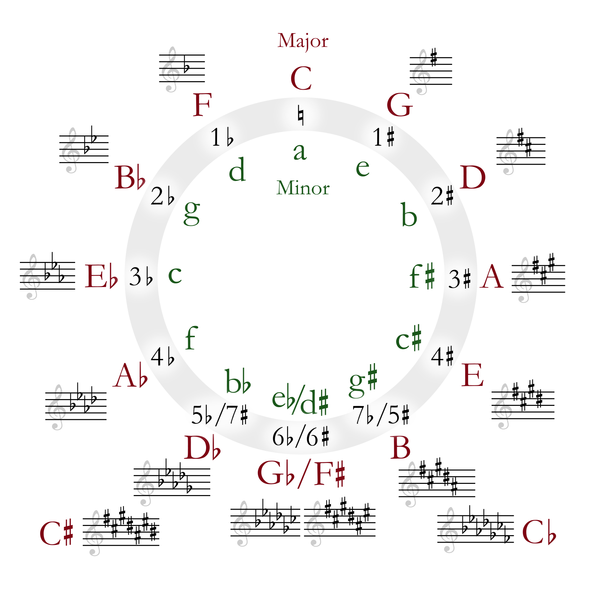

# 乐理笔记
## 钢琴键盘

- 钢琴有 88 个键，其中 52 个键为白键，36 个键为黑键
- 去掉左侧的三个键和右侧的一个键，剩下的 84 个键可以分为 7 组，每组有 7 个白键、5 个黑键
- 88 个键按组划分：
    - 低音区：
        - 大字二组：A₂、B₂
        - 大字一组：C₁、D₁、E₁、F₁、G₁、A₁、B₁
        - 大字组：C、D、E、F、G、A、B
    - 中音区：
        - 小字组：c、d、e、f、g、a、b
        - 小字一组：c¹、d¹、f¹、g¹、a¹、b¹
        - 小字二组：c²、d²、f²、g²、a²、b²
    - 高音区：
        - 小字三组：c³、d³、f³、g³、a³、b³
        - 小字四组：c⁴、d⁴、f⁴、g⁴、a⁴、b⁴
        - 小字五组：c⁵
- c¹ 为中央C音，频率为 261.63Hz
- a¹ 为国际标准A音，频率为 440Hz

## 音名、唱名与乐名

- 每组内的白键的**音名**依次为 C、D、E、F、G、A、B
- 每组内的黑键的**音名**依次为 C♯、D♯、F♯、G♯、A♯，或者 C♭、D♭、E♭、G♭、A♭、B♭
- ♯表示**升**一个半音，♭表示**降**一个半音

每个音名对应的唱名、乐名与简谱如下：

| 音名  | 唱名  |  乐名  | 简谱  |
| :---: | :---: | :----: | :---: |
|   C   |  do   |  主音  |   1   |
|   D   |  re   | 上主音 |   2   |
|   E   |  mi   |  中音  |   3   |
|   F   |  fa   | 下属音 |   4   |
|   G   |  sol  |  属音  |   5   |
|   A   |  la   | 下中音 |   6   |
|   B   |  si   |  导音  |   7   |

## 拍号与BPM

拍号 (Time Signature) 是在乐谱中使用的符号，用分数的形式来标画，用于决定乐曲的节奏律动。

- 拍号用两个数字表示，分母表示一拍的时值，分子表示每小节的拍数
- 4/4 读作“以4分音符为一拍，每小节4拍”
- 一个全音符的拍数等于拍号的分母
- 一个小节的时值等于以全音符为单位的拍号的值

仅通过音符时值与节拍，还不能得到具体的时间值。为此，我们需要一个乐曲速度单位 BPM (Beats Per Minute)，即每分钟的拍数：

- 一个拍子的时间 = 60 / BPM
- 一个小节的时间 = 60 / BPM * 拍号分子
- 一个全音符的时间 = 60 / BPM * 拍号分母

## 音程

音程 (Interval) 是两个音之间的距离，通过度数和音数来确定：

- 音数是指两个音之间包含的半音或全音的数量，全音=2个半音
- 度数是指两个音之间的的音级数量，也就是白键的数量，如果要衡量黑键则要先将其还原为白键，例如 C♯ 到 E 是三度，D♭ 到 E 是二度

音程性质由度数和音数共同决定，主要分为以下几类：

- 纯音程 (Perfect Intervals)
    - 纯一度（P1）：0 个半音
    - 纯四度（P4）：5 个半音
    - 纯五度（P5）：7 个半音
    - 纯八度（P8）：12 个半音
- 大音程与小音程 (Major/Minor Intervals)
    - **大音程**：比小音程多 1 个半音
    - **小音程**：比大音程少 1 个半音
    - 大/小二度（M2/m2）：1 或 2 个半音
    - 大/小三度（M3/m3）：3 或 4 个半音
    - 大/小六度（M6/m6）：8 或 9 个半音
    - 大/小七度（M7/m7）：10 或 11 个半音
- 增音程与减音程 (Augmented/Diminished Intervals)
    - **增音程**：比纯音程或大音程多 1 个半音
    - **减音程**：比纯音程或小音程少 1 个半音
    - **倍增/倍减音程**：进一步扩大或缩小半音数
    - 增四度：6 个半音
    - 减五度：6 个半音

根据听觉的协和程度划分：

- 协和音程：
    - 极完全协和音程：
        - 纯一度：音高比为 1:1
        - 纯八度：音高比为 2:1
    - 完全协和音程：
        - 纯四度：音高比约为 4:3
        - 纯五度：音高比约为 3:2
    - 不完全协和音程：
        - 大三度：音高比约为 5:4
        - 小三度：音高比约为 6:5
        - 大六度：音高比约为 5:3
        - 小六度：音高比约为 8:5
- 不协和音程：
    - 极不协和：
        - 小二度：音高比约为 16:15
        - 大七度：音高比约为 15:8
    - 不协和：
        - 大二度：音高比约为 9:8
        - 小七度：音高比约为 9:5
        - 所有增/减音程：音高比较为复杂

## 调式

调式 (Mode) 是由若干个音按照一定的音程关系排列组合而成的体系，决定了音乐的情感色彩和风格。通常在阐述调式这一概念时，常常把调式的中心音，也即主音作为起点和终点，其他各音按音高的顺序依次排列成音阶的形式，称为调式音阶。

### 谱号与调号

谱号 (Clef) 是写在五线谱左端以确定谱表中各线（间）具体音高的符号，常见的谱号分为F谱号（𝄢）、C谱号（𝄡）和G谱号（𝄞）三类：

- F谱号：花体字母 F 演变而来，表示起笔的线（间）为 f 音
- C谱号：花体字母 C 演变而来，谱号中央所对应的线（间）为 c¹ 音（中央C）
- G谱号：花体字母 G 演变而来，表示起笔的线（间）为 g¹ 音

调号 (Key Signature) 是表示乐曲所用调域的记号，在简谱用“主音=音名”来表示，而五线谱则用记在谱号后面的变音记号表示，同一调号可对应多种调式。

五度圈可以迅速地在自然大调和调号之间进行转换：

- 五度圈的由来：
    - 从 F 开始不断升高纯五度，可以依次得到 F、C、G、D、A、E、B、G♭/F♯、D♭/C♯、A♭/G♯、E♭/D♯、B♭/A♯，形成一个五度圈
    - 从任意一个音开始的七个音都符合五度相生的规律，因此将 FCGDAEB 条带旋转到任意位置，用重叠的音代替条带上的音，仍能保持音阶不变
    - 例如，FCGDAEB 条带顺时针旋转一格变为 CGDAEBF♯（G 代替了 C、A 代替了 G……），即可得到 G 大调 G、A、B、C、D、E、F♯
- 升号调号转换：
    - 口诀：4152637 或 F♯C♯G♯D♯A♯E♯B♯（五度圈中黑键的顺时针顺序，调号中有几个升号，口号中的头几个音就是升音）
    - 调式转调号：
        - 原理：将主音顺时针旋转五格即可到达条带的最后一格，相当于**将主音降低一个半音**，然后沿着条带最后一格逆时针计数（相当于在口诀中往前数），即可得到条带中有几个黑键
        - 示例：将 E 降低一个半音得到 D♯，在口诀中从 D♯ 开始往前加上升号，可以得到 F♯、C♯、G♯、D♯，这就是 E 大调中所有的黑键，也就是调号中所有的升号
    - 调号转调式：
        - 原理：将条带的最后一格顺时针旋转七格即可到达主音，相当于**将口诀中最后一个升音升高一个半音**
        - 示例：若一个调号有六个升号，则根据口诀可得 F♯、C♯、G♯、D♯、A♯、E♯、B，将 E♯ 升高半音可得 F♯，因此是 F♯ 大调
- 降号调号转换：
    - 口诀：7362514 或 B♭E♭A♭D♭G♭C♭F♭（五度圈中黑键的逆时针顺序，调号中有几个降号，口号中的头几个音就是降音）
    - 调式转调号：
        - 原理：将主音逆时针旋转一格即可到达条带的第一格，相当于**将主音降低七个半音**，然后沿着条带第一格顺时针计数（相当于在口诀中往前数），即可得到条带中有几个黑键
        - 示例：将 B♭ 降低七个半音得到 E♭，在口诀中从 E♭ 开始往前加上降号，可以得到 B♭、E♭，这就是 B♭ 大调中所有的黑键，也就是调号中所有的降号
    - 调号转调式：
        - 原理：将条带的第一格顺时针旋转一格即可到达主音，相当于**将口诀中最后一个降音升高七个半音**
        - 示例：若一个调号有六个降号，则根据口诀可得 B♭、E♭、A♭、D♭、G♭、C♭、F，将 C♭ 升高七个半音可得 G♭，因此是 G♭ 大调

### 调式的分类
#### 自然调式

- 自然大调：
    - 音阶结构：全全半全全全半
    - 示例：C、D、E、F、G、A、B、C（C大调）
    - 特点：明亮、开朗、宏伟，常用于表现欢快、庄严的情感
- 自然小调：
    - 音阶结构：全半全全半全全
    - 示例：A、B、C、D、E、F、G、A（a小调）
    - 特点：忧郁、深沉、柔和，常用于表现悲伤、忧郁的情感

#### 和声调式

- 和声大调：
    - 音阶结构：在自然大调的基础上，将六音降低半音
    - 示例：C、D、E♭、F、G、A♭、B、C
    - 特点：具有中东或东欧民间音乐的风格，常用于表现神秘、异国情调的情感
- 和声小调：
    - 音阶结构：在自然小调的基础上，将七音升高半音
    - 示例：A、B、C、D、E、F、G♯、A
    - 特点：具有强烈的民族色彩，常用于表现戏剧性、紧张感的情感

#### 旋律调式

- 旋律大调：
    - 音阶结构：上行时同自然大调，下行时将自然大调的六音和七音降低半音
    - 下行：C、A♭、B♭、G、F、E、D、C
    - 特点：具有明亮而华丽的色彩，常用于表现欢快、辉煌的情感
- 旋律小调：
    - 音阶结构：上行时自然小调的六音和七音升高半音，下行时同自然小调
    - 上行：A、B、C、D、E、F♯、G♯、A
    - 特点：具有戏剧性和紧张感，常用于表现深沉、忧郁的情感

### 关系大小调

关系大小调 (Relative Keys)，又称平行大小调，是指一对具有相同调号（即相同数量的升号或降号）的大调和小调，其中前者为后者的**关系大调**，后者为前者的**关系小调**。

- 关系大小调共享相同的音阶音，但主音（中心音）不同
- C 大调 (1=C) 和 a 小调 (6=A) 的音阶均由 A、B、C、D、E、F、G 构成，音列相同，五线谱调号均为无升降号，C 大调的主音 C 比 a 小调的主音 A 高一个小三度，故 C 大调和 a 小调互为关系大小调
- 从大调到小调：找到大调音阶的第六个音，把它作为小调的主音
- 从小调到大调：找到小调音阶的第三个音，把它作为大调的主音

### 中国民族调式
#### 五声音阶

中国传统音乐的核心音阶体系是**五声音阶** (Pentatonic Scale)，由五个音组成，即宫商角徵羽，有时会加入变宫或清角形成六声或七声音阶。这几个音与西方音名的对应关系为：

| 阶名  | 音名  | 唱名  |
| :---: | :---: | :---: |
|  宫   |   C   |  do   |
|  商   |   D   |  re   |
|  角   |   E   |  mi   |
| 清角  |   F   |  fa   |
|  徵   |   G   |  sol  |
|  羽   |   A   |  la   |
| 变宫  |   B   |  si   |

五声音阶可以以任意一音为主音，形成五种不同的调式：

|  调式名称  | 主音  |     音阶结构      |        音乐性格        |
| :--------: | :---: | :---------------: | :--------------------: |
| **宫调式** |  宫   | C - D - E - G - A | 明亮、庄严（类似大调） |
| **商调式** |  商   | D - E - G - A - C |    略带忧伤、叙事性    |
| **角调式** |  角   | E - G - A - C - D | 幽远、神秘（较少使用） |
| **徵调式** |  徵   | G - A - C - D - E | 欢快、活泼（类似属调） |
| **羽调式** |  羽   | A - C - D - E - G | 忧郁、柔美（类似小调） |

#### 三分损益法

中国最早的音阶理论记载见于《管子·地员篇》，采用**三分损益法**（即五度相生律）生成五音：  

+ 确定基准音“宫”（如黄钟律，相当于C）
+ **三分损一**（将弦长减1/3，即升高纯五度）生成“徵”（G）
+ **三分益一**（将弦长增1/3，即降低纯四度，相当于先升高纯五度再降低八度）生成“商”（D）
+ 重复此过程，依次得到“羽”（A）和“角”（E）

具体步骤如下：

| 生成顺序 | 操作       | 所得音 | 阶名 | 现代音名 |
| -------- | ---------- | ------ | ---- | -------- |
| 1        | 定基准音   | 宫     | C    | 根音     |
| 2        | 宫 × (2/3) | 徵     | G    | 纯五度   |
| 3        | 徵 × (4/3) | 商     | D    | 大二度   |
| 4        | 商 × (2/3) | 羽     | A    | 大六度   |
| 5        | 羽 × (4/3) | 角     | E    | 大三度   |

在五声音阶（C-D-E-G-A）基础上，继续使用三分损益法，可以继续生成新音：

+ 从“角”（E）向上五度生“变宫”（B）
+ 从“变宫”（B）向下四度生“变徵”（F♯）
+ 从“宫”（C）向下五度生“清角”（F）

#### 七声音阶

中国古代七声音阶有：

- **清乐调式**：宫、商、角、清角、徵、羽、变宫，分别对应 1、2、3、4、5、6、7
- **雅乐调式**：宫、商、角、变徵、徵、羽、变宫，分别对应 1、2、3、4♯、5、6、7
- **燕乐调式**：宫、商、角、清角、徵、羽、闰，分别对应 1、2、3、4、5、6、7♭

以上调式以五个不同的正声为主音，可以构成不同的五个调式，其中清乐宫调式相当于现在的自然大调。

## 和弦

和弦 (Chord) 是三个或三个以上不同音高的音，按照一定的音程关系组合而成的结构，是和声学的基本单位。和弦的构成、性质、功能及连接方式直接影响音乐的色彩、张力和情感表达。

在和弦的基本形态中，最下端的音叫做根音，其余各音均按它们与根音构成的音程关系来命名。

### 三和弦

三和弦 (Triad) 是三个音按照三度关系叠加的和弦，三个音分别被称为**根音**、**三音**和**五音**。

|       和弦类型        |    音程结构     |  三音  |  五音  |    示例     | 和弦名 |
| :-------------------: | :-------------: | :----: | :----: | :---------: | :----: |
|   大三和弦 (Major)    | 大三度 + 小三度 | 大三度 | 纯五度 |  C - E - G  |   C    |
|   小三和弦 (Minor)    | 小三度 + 大三度 | 小三度 | 纯五度 | C - E♭ - G  |   Cm   |
| 增三和弦 (Augmented)  | 大三度 + 大三度 | 大三度 | 增五度 | C - E - G♯  |  Caug  |
| 减三和弦 (Diminished) | 小三度 + 小三度 | 小三度 | 减五度 | C - E♭ - G♭ |  Cdim  |

每个调式都有七个三和弦，这七个三和弦没有升降号，也即没有离调音，因此被称为本调和弦，以 C 大调为例：

| 级数  |  三和弦   | 和弦类型 |   别称   |
| :---: | :-------: | :------: | :------: |
|   1   | C - E - G | 大三和弦 |  主和弦  |
|   2   | D - F - A | 小三和弦 |          |
|   3   | E - G - B | 小三和弦 |          |
|   4   | F - A - C | 大三和弦 | 下属和弦 |
|   5   | G - B - D | 大三和弦 |  属和弦  |
|   6   | A - C - E | 小三和弦 |          |
|   7   | B - D - F | 减三和弦 |          |

### 七和弦

七和弦 (Seventh Chord) 是四个音按照三度关系叠加的和弦，也即在三和弦的基础上增加一个七音，构成七和弦。

|       和弦类型        |     音程结构      |  七音  |       示例       |  和弦名   |
| :-------------------: | :---------------: | :----: | :--------------: | :-------: |
|  大七和弦/大大七和弦  | 大三和弦 + 大三度 | 大七度 |  C - E - G - B   | CM7/Cmaj7 |
|  属七和弦/大小七和弦  | 大三和弦 + 小三度 | 小七度 |  C - E - G - B♭  |    C7     |
|  小七和弦/小小七和弦  | 小三和弦 + 小三度 | 小七度 | C - E♭ - G - B♭  | Cm7/Cmin7 |
| 半属七和弦/小大七和弦 | 小三和弦 + 大三度 | 大七度 |  C - E♭ - G - B  | CmM7/C-△  |
|  减七和弦/减小七和弦  | 减三和弦 + 小三度 | 小七度 | C - E♭ - G♭ - B♭ |   Cdim7   |
| 半减七和弦/减减七和弦 | 减三和弦 + 大三度 | 减七度 | C - E♭ - G♭ - B♭ |   Cm7-5   |

如果大小七和弦中的根音是这个调式中的属音，那么这个和弦也可以被称为**属七和弦**，例如 C7 在 F 调，G7 在 C 调。每个调式只有一个属七和弦（没有离调音），其他的都叫大小七和弦（有离调音）。

### 九和弦

九和弦 (Ninth Chord) 是五个音按照三度关系叠加的和弦，也即在七和弦的基础上增加一个九音，构成九和弦。

|   和弦类型   |     音程结构      |        示例         |  和弦名   |
| :----------: | :---------------: | :-----------------: | :-------: |
|   大九和弦   | 大七和弦 + 小三度 |  C - E - G - B - D  | CM9/Cmaj9 |
|   小九和弦   | 小七和弦 + 大三度 | C - E♭ - G - B♭ - D |    Cm9    |
|   属九和弦   | 属七和弦 + 大三度 | C - E - G - B♭ - D  |    C9     |
| 属七降九和弦 | 属七和弦 + 小三度 | C - E - G - B♭ - D♭ |   C7b9    |
|  ADD9 和弦   |   三和弦 + 九音   |   C - E - G  - D    |   Cadd9   |

和属七和弦一样，每个调式中也只有一个属九和弦。

### 挂留和弦

**挂留和弦** (Suspended) 一般指用二度音或者纯四度音代替原来的三度音而排列组合成的和弦：

- 挂二和弦：用二度音替换原本的三度音，例如 C - D - G (Csus2)
- 挂四和弦：用纯四度音替换原本的三度音，例如 C - F - G (Csus4)

挂留和弦一般用于调式的 1 级和弦和 5 级和弦。

### 转位和弦

以根音为最低音的和弦叫**原位和弦**，如果以三音、五音或者七音为最低音，则被称为**转位和弦**。转位和弦可以避免低音跳跃过大，使和声进行更自然，不会影响和弦功能。

- 第一转位：以三音为最低音的和弦，标记为“和弦名/三音”，例如 C 大三和弦的第一转位 C/E 为 E - G - C
- 第二转位：以五音为最低音的和弦，标记为“和弦名/五音”，例如 C 大三和弦的第二转位 C/G 为 G - B - C
- 第三转位：以七音为最低音的和弦，标记为“和弦名/七音”，例如 C 属七和弦的第三转位 C7/B♭ 为 B♭ - C - E - G
