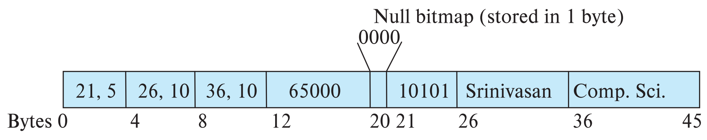
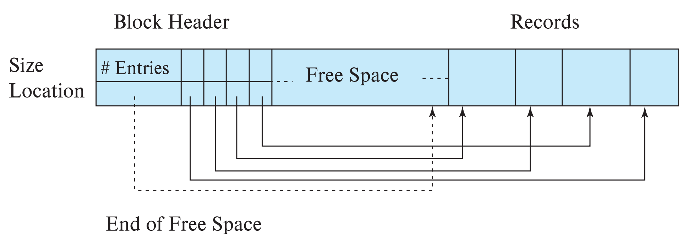

# 数据存储结构

## 文件组织

数据库是一系列文件 (file) 的集合，文件是一系列记录 (record) 的集合，记录是一系列字段 (field) 的集合。我们假设每条记录的大小小于磁盘块的大小。

### 定长记录

定长记录 (fixed-length record) 可以直接顺序存储，通过 $n \times (i - 1)$ 得到第 i 条记录的起始地址。

定长记录的删除有以下几种方式：

- 将第 i 条记录后面的所有记录向前移动一个位置
- 将最后一条记录移动到第 i 条记录的位置
- 将第 i 条记录加入空闲链表 (free list) 中，标志已被删除，下次插入记录时优先插入空闲链表

### 变长记录

变长记录 (variable-length record) 可能因为以下几种情况产生：

- 在一个文件中存储多种记录
- 记录中有可变长度的字段
- 记录中有可重复的字段

一种可行的存储方式是，先放上每个变长字段的偏移量和长度，再放上定长字段，然后放上空位图 (null bitmap) 和变长字段。空位图的每一位对应一个字段，表示该字段是否为空。

然后我们可以在一个块中使用分槽页结构 (slotted-page structure) 来存储变长记录。分槽页结构将记录数量、空闲空间的尾部位置、每个记录的长度和起始地址存储在页的头部，然后将记录存储在页的尾部。

 

## 文件中记录的组织

记录在文件中有以下几种组织方式：

- Heap: 记录可以放在文件中的任何地方
- Sequential: 根据记录的搜索键的值，将记录按顺序存储
- Multitable clustering: 将多个表的记录存储在同一个文件中
- B+-tree: 有序存储，即使有插入和删除操作
- Hashing: 根据搜索键的哈希值，将记录放在文件的某个块中

### 堆文件组织

堆文件组织 (Heap File Organization) 是最简单的文件组织方式，记录在文件中的顺序是任意的。堆文件组织的优点是插入和删除记录的代价较低，缺点是查找记录的代价较高。

为了更快找到空闲空间，可以使用 free-space map。

### 顺序文件组织

顺序文件组织 (Sequential File Organization) 是将记录按照某个字段 (search-key) 的值排序后存储。这样可以加快查找记录的速度，但插入和删除记录的代价较高。

删除记录时可以使用指针链 (pointer chains)。插入记录时，如果有空闲空间则插入，否则插入到溢出块 (overflow block)。在任一情况下，都需要更新指针链，并且需要定期重新组织文件以恢复顺序。

### 多表聚簇文件组织

多表聚簇文件组织 (Multitable Clustering File Organization) 是将多个表存储在同一个文件之中，会导致文件中出现变长记录。这样可以加快多张表连接操作的速度，但对单张表的操作速度会变慢。

### 表分区

表分区 (Table Partitioning) 是将一个关系中的记录分成多份，分别存储在不同的文件中，比如将 2018 年的记录放一个地方，2019 年的放另一个地方。这样可以减少一些操作的代价，比如空闲空间管理，还可以将不同的分区存储在不同的存储设备上，比如将今年的记录放在 SSD 上，提高操作速度。

 

## 缓存管理

数据库系统希望尽可能减少磁盘和内存之间的块传输次数，因此会尽可能将要用到的块存储在主存中。缓冲区管理器 (Buffer Manager) 就是负责在主存中分配缓冲区空间的子系统。

当需要用到磁盘中的一个块时，缓冲区管理器会做出以下操作：

- 如果块已经在缓冲区中，缓冲区管理器会直接返回块在主存中的地址
- 如果块不在缓冲区中，缓冲区管理器会先为块分配缓冲区空间，然后从磁盘读取块到缓冲区中
    - 如果需要，缓冲区管理器会替换掉其他块，为新块腾出空间
    - 如果被替换的块被修改过，那么需要先将其写回磁盘

缓存替换策略有以下几种：

- 最近最少使用 (Least Recently Used, LRU)：替换最近最少使用的块。对于某些重复扫描数据的访问模式，LRU 可能不是一个好的策略
- 立即丢弃 (Toss Immediate)：当一个块的最后一个元组被处理完后，立即释放该块的空间
- 最近最常使用 (Most Recently Used, MRU)：系统会锁定当前正在处理的块，当该块的最后一个元组被处理完后，解锁该块，使其成为最近最常使用的块
- 时钟 (Clock)：维护一个环形链表，每个块有一个位 (reference_bit) 表示是否被访问过，1 表示被访问过，0 表示未被访问过。当需要替换块时，从当前位置开始，遇到被访问过的块就将其 reference_bit 设为 0，直到找到一个未被访问过的块为止。这是 LRU 策略的近似，实现上更加简单

 

## 面向列的存储

列存储 (Column-Oriented Storage) 是将关系的每个属性单独存储的方式。列存储的优点有：

- 如果只有一部分属性被访问，可以减少 I/O 次数
- 可以提高 CPU 缓存性能
- 可以提高压缩效率
- 可以在现代 CPU 架构上实现向量处理

列存储的缺点有：

- 从列存储中重建元组的代价较高
- 元组的删除和更新代价较高
- 解压缩代价较高

列存储在决策支持系统中比行存储更有效，而在事务处理中，传统的行存储更受欢迎。一些数据库支持同时使用两种存储方式，称为混合行列存储 (Hybrid Row/Column Stores)。
