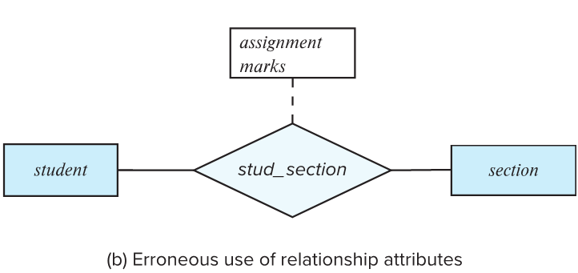
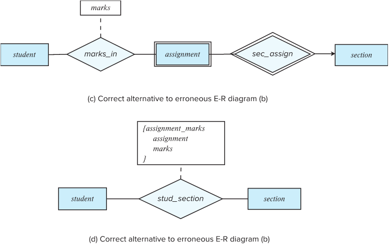
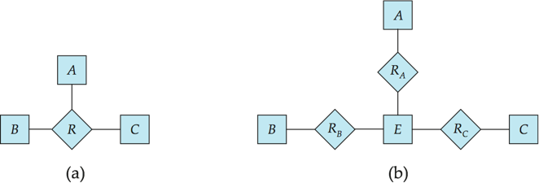
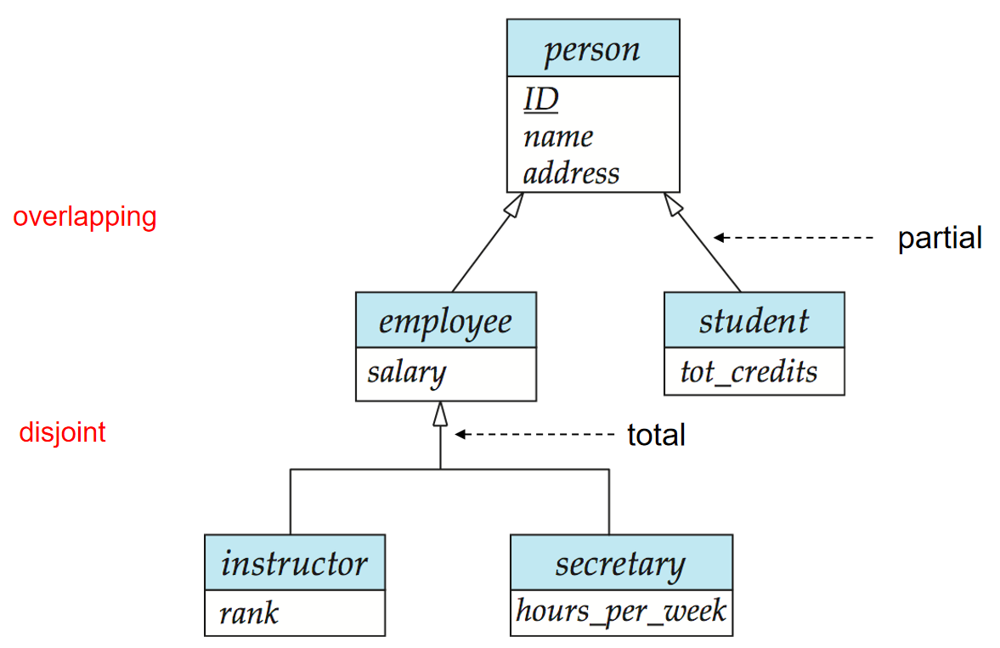

# 实体-关系模型

## 数据库模型

### 实体

实体 (Entity) 是数据库中的基本对象，可以与其他对象相区分。实体属性 (Attributes) 是实体的特征，是实体的描述性信息。实体集 (Entity Set) 则是同一类实体的集合。

### 关系

关系 (Relationship) 是不同实体之间的联系，关系集 (Relationship Set) 则是同一类关系的集合，其数学表达式为：

$$
\{ (e_1, e_2, \cdots, e_n) | e_1 \in E_1, e_2 \in E_2, \cdots, e_n \in E_n \}
$$

关系中的实体集可以是相同的，只是扮演着不同的角色。

关系的度 (Degree) 是关系中实体集的个数，可据此分为二元关系 (Binary Relationship)、三元关系 (Ternary Relationship) 等。

### 属性

实体由一系列属性描述，属性可以分为：

- 简单属性 (Simple Attribute) 和复合属性 (Composite Attribute)
- 单值属性 (Single-valued Attribute) 和多值属性 (Multi-valued Attribute)
- 派生属性 (Derived Attribute) 和存储属性 (Stored Attribute)。派生属性可通过其他属性计算得到

复合属性最终会被铺平为简单属性，例如复合属性 `name` 被拆分为 `first_name` `middle_initial` 和 `last_name`，如果有歧义的话还会在前面加上 `name_` 前缀。

一个在实体 E 上的多值属性 M 会由一个独立的模式 EM 来表示，其中会包含 E 的主键和 M 的值。若 E 只有主键和这个多值属性，可以直接将 E 优化为 EM，不过这也会导致 E 的主键重复出现，无法被外键引用。

### 映射基数约束

映射基数约束 (Mapping Cardinality Constraints) 是指一个实体最多可以通过关系与其他实体产生联系的次数，常用于二元关系中，有四种类型：

- 一对一 (One-to-One)
- 一对多 (One-to-Many)
- 多对一 (Many-to-One)
- 多对多 (Many-to-Many)

### 弱实体集

一个没有主键的实体集被称为弱实体集，弱实体集依赖于标识性实体集 (Identifying Entity Set)，必须通过完全参与、一对多的关系与标识性实体集相连，这个联系被称为标志性联系 (Identifying Relationship)。

当依赖的标志性实体存在时，弱实体集中的实体可以用一组属性来区分，这组属性被称为分辨符 (discriminator)，也被称为部分键 (partial key)。弱实体集的主键由标识性实体集的主键和自己的分辨符组成。

需要注意的是，强实体集的主键并不会存储在弱实体集中，而是隐含在标志性联系中。因为弱实体集与强实体集的关系是多对一的，每一个弱实体集中的实体都能通过标志性联系找到唯一的强实体集中的实体。如果强实体集的主键存储在了弱实体集中的话，就会产生冗余属性 (Redundant Attribute)。

 

## 实体-关系图

实体-关系图 (E-R Diagram) 是一种用来描述实体间联系的图形化工具。在其中，各图形的含义为：

- 矩形代表实体集，菱形代表关系集，椭圆代表属性
- 双实线矩形代表弱实体集
- 双实线菱形代表标志性联系
- 下划实线代表主键，下滑虚线代表分辨符

不同连线的含义为：

- 参与情况
    - 单实线：部分参与 (Partial participation)，即只有实体的一部分实例参与关系
    - 双实线：完全参与 (Total participation)，即实体的所有实例都参与关系
- 基数约束
    - 有箭头：箭头另一侧的实体最多只能参与一次关系
    - 无箭头：连线另一侧的实体可以多次参与关系，包括 0 次
    - 还可以在实体集和关系集连线上标注 `l..h`，其中 `l` 代表基数的下限，`h` 代表基数的上限。这样以后，下限为 1 代表完全参与，上限为 1 代表最多参与一次，上限为 `*` 代表没有限制
- 虚线：连接关系和属性，表示关系的属性

对于三元或者更多元的关系，最多允许一个箭头从关系中伸出，代表其他实体的组合最多只能出现一次。

!!! example "实体关系图示例"
    

 

## 关系模式的简化

实体集和关系集可以统一表示为关系模型，符合 E-R 图的数据库则可以表示为一系列关系模式的集合，其中实体集和关系集的转换如下：

- 强实体集：属性不变
- 弱实体集：添加标识性强实体集的主键作为属性，与自己的分辨符一起组成主键
- 多对多关系：包含两侧的主键以及可能的描述性属性
- 一对多关系：该关系是冗余的，可以通过在多的一侧添加属性来表示。如果多的一侧没有完全参与，对应的属性可以为空
- 一对一关系：可以将任意一侧作为多的一侧

 

## 设计问题

常见的设计错误有：

- 属性冗余
- 属性使用不当，本来应该是多值的属性被设计成了单值属性，此时可以将其定义为多值属性，或者新建一个关系：

  

  

设计时的权衡有：

- 实体集 vs 属性：可以在实体集中使用多值属性，也可以将多值属性转换为实体集，例如将 `phone_number` 属性转换为 `phone` 实体集，此时可以方便地为每个电话号码添加属性，还可以方便地表示共享电话号码
- 实体集 vs 关系集：如果关系集的属性很多，可以考虑将其转换为实体集，然后再与原来相连的实体集建立新的关系，例如将 `buy` 转换为 `order`，此时可以方便地为每个订单添加付款情况、物流信息等属性，还可以方便地与更多实体集相连
- 属性置于关系 vs 属性置于实体：若只需注意该动作最后的结果，则可以将属性置于实体，否则需要置于关系，例如将 `date` 属性置于 `access` 关系，则可以查询每次访问的时间，而将其置于 `user` 实体，则可以查询用户的最后访问时间
- 二元关系 vs 多元关系：尽管可以将多元关系转换为二元关系，但有时候多元关系更加直观且方便。转换的方法为，先用一个新的实体集替换多元关系集，然后再让这个实体集与原来的实体集建立新的二元关系：

  

 

## 特化和概化

- 特化 (Specialization) 是一个自顶而下的过程，子实体集会继承父实体集的所有属性和关系参与情况
- 概化 (Generalization) 是一个自底而上的过程，会将有相同特征的实体集合并为一个更高层级的实体集

特化和概化是两个可交换的概念，在 ER 图中的表示是相同的：

  

图中约束的含义如下：

- Disjoint: 实体只能属于一个子实体集
- Overlapping: 实体可以属于多个子实体集
- Partial: 实体可能不属于任意一个子实体集
- Total: 实体必须属于其中一个子实体集

Partial 和 Total 属于完全性约束 (Completeness constraint)。
