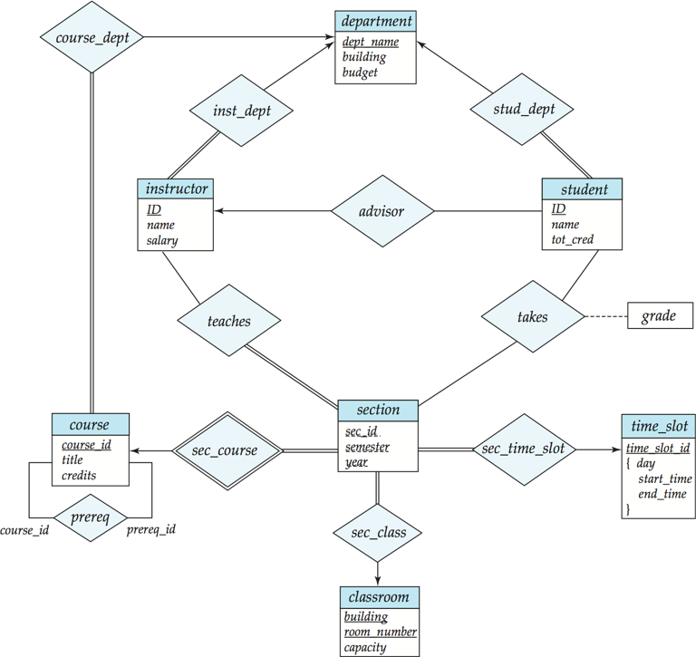

# 实体-关系模型

## 数据库模型

### 实体

实体 (Entity) 是数据库中的基本对象，可以与其他对象相区分。实体属性 (Attributes) 是实体的特征，是实体的描述性信息。实体集 (Entity Set) 则是同一类实体的集合。

### 关系

关系 (Relationship) 是不同实体之间的联系，关系集 (Relationship Set) 则是同一类关系的集合，其数学表达式为：

$$
\{ (e_1, e_2, \cdots, e_n) | e_1 \in E_1, e_2 \in E_2, \cdots, e_n \in E_n \}
$$

关系中的实体集可以是相同的，只是扮演着不同的角色。

关系的度 (Degree) 是关系中实体集的个数，可据此分为二元关系 (Binary Relationship)、三元关系 (Ternary Relationship) 等。

### 属性

实体由一系列属性描述，属性可以分为：

- 简单属性 (Simple Attribute) 和复合属性 (Composite Attribute)
- 单值属性 (Single-valued Attribute) 和多值属性 (Multi-valued Attribute)
- 派生属性 (Derived Attribute) 和存储属性 (Stored Attribute)。派生属性可通过其他属性计算得到

### 映射基数约束

映射基数约束 (Mapping Cardinality Constraints) 是指一个实体最多可以通过关系与其他实体产生联系的次数，常用于二元关系中，有三种类型：

- 一对一 (One-to-One)
- 一对多 (One-to-Many)
- 多对多 (Many-to-Many)

 

## 实体-关系图

实体-关系图 (E-R Diagram) 是一种用来描述实体间联系的图形化工具。在其中，各图形的含义为：

- 矩形代表实体集，菱形代表关系，椭圆代表属性
- 双实线矩形代表弱实体，依赖于其他实体，通常主键由其他实体的主键组合而成
- 双实线菱形代表弱关系，通常与弱实体一起使用

不同连线的含义为：

- 参与情况
    - 单实线：部分参与 (Partial participation)，即只有实体的一部分实例参与关系
    - 双实线：完全参与 (Total participation)，即实体的所有实例都参与关系
- 基数约束
    - 有箭头：箭头另一侧的实体最多只能参与一次关系
    - 无箭头：连线另一侧的实体可以多次参与关系，包括 0 次
    - 还可以在连线上标注 `l..h`，其中 `l` 代表基数的下限，`h` 代表基数的上限，可以使用 `*` 表示没有限制。这样以后，无箭头单实线就是 `0..*`，有箭头单实线就是 `1..1`
- 虚线：连接关系和属性，表示关系的属性

对于三元或者更多元的关系，最多允许一个箭头从关系中伸出，代表其他实体的组合最多只能出现一次。

!!! example "实体关系图示例"
    
