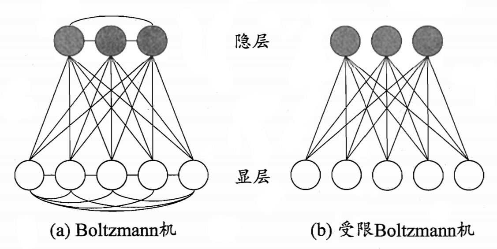

# 神经网络
## 神经网络历史

### 第一阶段

- 1943年，McCulloch 和 Pitts 提出第一个神经元数学模型，即 **M-P 模型**，并从原理上证明了人工神经网络能够计算任何算数和逻辑函数
- 1949年，Hebb 发表《The Organization of Behavior》一书，提出生物神经元学习的机理，即 **Hebb 学习规则**
- 1956年，在达特茅斯学院中，约翰·麦卡锡、马文·闵斯基、克劳德·香农等科学家召开会议，提出了**人工智能**的概念
- 1958年，Rosenblatt 提出**感知机网络**（Perceptron）模型和其学习规则
- 1960年，Widrow 和 Hoff 提出**自适应线性神经元**（Adaline）模型和最小均方学习算法
- 1969年，Minsky 和 Papert 发表《Perceptrons》一书，指出单层神经网路不能解决非线性问题，多层网络的训练算法尚无希望. 这个论断导致神经网络进入低谷

### 第二阶段

- 1982年，物理学家 Hopfield 提出了一种具有联想记忆、优化计算能力的递归网络模型，即 **Hopfield 网络**
- 1986年，Rumelhart 等编辑的著作《Parallel Distributed Processing: Explorations in the Microstructures of Cognition》报告了**反向传播算法**
- 1987年，IEEE 在美国加州圣地亚哥召开第一届神经网络国际会议（ICNN）
- 90年代初，伴随统计学习理论和 SVM 的兴起，神经网络由于理论不够清楚，试错性强，难以训练，再次进入低谷

### 第三阶段

- 2006年，Hinton 提出了**深度信念网络**（DBN），通过“预训练+微调”使得深度模型的最优化变得相对容易
- 2012年，Hinton 组参加 ImageNet 竞赛，使用 **CNN 模型**以超过第二名10个百分点的成绩夺得当年竞赛的冠军
- 伴随云计算、大数据时代的到来，计算能力的大幅提升，使得深度学习模型在计算机视觉、自然语言处理、语音识别等众多领域都取得了较大的成功

## 神经元模型

**神经网络的定义**：神经网络是由具有适应性的简单单元组成的广泛并行互连的网络，它的组织能够模拟生物神经系统对真实世界物体所作出的交互反应。

**神经元模型**：神经网络中最基本的成分是神经元（neuron）模型，即上述定义中的“简单单元”。在**生物神经网络**中，每个神经元与其他神经元相连，当它“兴奋”时, 就会向相连的神经元发送化学物质，从而改变这些神经元内的电位；如果某神经元的电位超过了一个“阈值”（threshold），那么它就会被激活，即“兴奋”起来，向其他神经元发送化学物质。

**M-P 神经元模型**：

- 输入：来自其他神经元传递过来的输入信号
- 处理：输入信号通过带权重的连接进行传递，神经元接受到总输入值将与神经元的阈值进行比较
- 输出：通过激活函数的处理以得到输出

$$
y = f \left( \sum_{i=1}^{n} w_i x_i - \theta \right)
$$

理想的激活函数是阶跃函数，但是阶跃函数具有不连续、不光滑等不太好的性质，因此实际常用 Sigmoid 函数作为激活函数。Sigmoid 函数把可能在较大范围内变化的输入值挤压到 (0,1) 输出值范围内，因此有时也称为“挤压函数”（squashing function）

把许多个这样的神经元按一定的层次结构连接起来，就得到了神经网络。

## 感知机与多层网络

**感知机**由两层神经元组成的神经网络，输入层接收外界输入信号后传递给输出层，输出层是 M-P 神经元。

感知机能容易地实现逻辑与、或、非运算。假定 $f$ 为阶跃函数，有

- “与”（$x_1 \wedge x_2$）：$y = f(x_1 + x_2 - 2)$
- “或”（$x_1 \vee x_2$）：$y = f(x_1 + x_2 - 1)$
- “非”（$\neg x_1$）：$y = f(-0.6 x_1 + 0.5)$

**感知机学习规则**：对训练样例 $(\bm{x}, y)$，若当前感知机的输出为 $\hat{y}$，则感知机权重将这样调整：

$$ w_i = w_i + \Delta w_i $$

$$ \Delta w_i = \eta (y - \hat{y}) x_i $$

其中 $\eta \in (0,1)$ 称为学习率。若感知机对训练样例预测正确，即 $y = \hat{y}$，则感知机不发生变化，否则将根据错误的程度进行权重调整。

感知机只有输出层神经元进行激活函数处理，即只拥有一层功能神经元（functional neuron），其学习能力非常有限。事实上，上述与、或、非问题都是线性可分（linearly separable）的问题。若两类模式是线性可分的，即存在一个线性超平面能将它们分开，则感知机的学习过程一定会收敛而求得适当的权向量 $\bm{w}$；否则感知机学习过程将会发生振荡，$\bm{w}$ 难以稳定下来，不能求得合适解。

要解决非线性可分问题，需考虑使用多层功能神经元。例如下面这个简单的两层感知机就能解决异或问题：

$$ a = \text{step}(x_1 - x_2 - 0.5) $$

$$ b = \text{step}(-x_1 + x_2 - 0.5)$$

$$ y = \text{step}(a + b - 0.5) $$

在输出层与输入层之间的一层神经元，被称为隐层或**隐含层**（hidden layer），隐含层和输出层神经元都是拥有激活函数的功能神经元。

更一般的，常见的神经网络是这样的层级结构：每层神经元与下一层神经元全互连，神经元之间不存在同层连接，也不存在跨层连接。这样的神经网络结构通常称为**多层前馈神经网络**（multi-layer feedforward neural network）。“前馈”并不意味着网络中信号不能向后传，而是指网络拓扑结构上不存在环或回路。

## 误差逆传播算法

**误差逆传播**（error BackPropagation, 简称 BP）算法是迄今最成功的神经网络学习算法。现实任务中使用神经网络时，大多是在使用 BP 算法进行训练。

对每个训练样例，BP算法执行以下操作：

- 将输入示例提供给输入层神经元，然后逐层将信号前传，直到产生输出层的结果
- 计算输出层的误差
- 将误差逆向传播至隐层神经元
- 根据隐层神经元的误差来对连接权和阈值进行调整，即

$$ \Delta w_{ij} = -\eta \frac{\partial E}{\partial w_{ij}} $$

常见的激活函数及其导数有：

| 名称 | 公式 | 导数 |
| --- | --- | --- |
| Sigmoid | $\sigma(x) = \frac{1}{1 + e^{-x}}$ | $\sigma'(x) = \sigma(x)(1-\sigma(x))$ |
| Tanh | $\tanh(x) = \frac{e^x - e^{-x}}{e^x + e^{-x}}$ | $\tanh'(x) = 1 - \tanh^2(x)$ |
| ReLU | $\text{ReLU}(x) = \max(0, x)$ | $\text{ReLU}'(x) = \begin{cases} 0 & x < 0 \\ 1 & x \geq 0 \end{cases}$ |

BP 算法的目标是要最小化训练集D上的累积误差：

$$ E = \sum_{k=1}^{m} E_k $$

上面介绍的“标准BP算法”每次仅针对一个训练样例更新连接权和阈值，即每次更新只针对单个的 $E_k$ 推导而得。若类似地推导出基于累积误差最小化的更新规则，就得到了**累积误差逆传播**（accumulated error backpropagation）算法。累积 BP 算法与标准 BP 算法都很常用。一般来说，标准 BP 算法每次更新只针对单个样例，参数更新得非常频繁，而且对不同样例进行更新的效果可能出现“抵消”现象。因此，为了达到同样的累积误差极小点，标准 BP 算法往往需进行更多次数的迭代。累积 BP 算法直接针对累积误差最小化，它在读取整个训练集 $D$ 一遍后才对参数进行更新，其参数更新的频率低得多。但在很多任务中，累积误差下降到一定程度之后，进一步下降会非常缓慢，这时标准 BP 往往会更快获得较好的解，尤其是在训练集非常大时更明显。

[Hornik et al., 1989] 证明，**只需一个包含足够多神经元的隐层，多层前馈网络就能以任意精度逼近任意复杂度的连续函数**。然而，如何设置隐层神经元的个数仍是个未决问题，实际应用中通常靠“试错法”（trial-by-error）调整。

正是由于其强大的表示能力，BP神经网络经常遭遇过拟合，其训练误差持续降低，但测试误差却可能上升。有两种策略常用来缓解BP网络的过拟合。第一种策略是**早停**（early stopping）：将数据分成训练集和验证集，训练集用来计算梯度、更新连接权和阈值，验证集用来估计误差，若训练集误差降低但验证集误差升高，则停止训练，同时返回具有最小验证集误差的连接权和阈值。第二种策略是**正则化**（regularization），其基本思想是在误差目标函数中增加一个用于描述网络复杂度的部分，例如连接权与阈值平方和。增加连接权与阈值平方和这一项后，训练过程将会偏好比较小的连接权和阈值，使网络输出更加“光滑”，从而对过拟合有所缓解。

## 全局最⼩与局部最⼩

在现实任务中，人们常采用以下策略来试图“跳出”局部极小，从而进一步接近全局最小：

- 以多组不同参数值初始化多个神经网络，按标准方法训练后，取其中误差最小的解作为最终参数。这相当于从多个不同的初始点开始搜索，这样就可能陷入不同的局部极小，从中进行选择有可能获得更接近全局最小的结果
- 使用**模拟退火**（simulated annealing）技术。模拟退火在每一步都以一定的概率接受比当前解更差的结果，从而有助于“跳出”局部极小。在每步迭代过程中，接受“次优解”的概率要随着时间的推移而逐渐降低，从而保证算法稳定
- 使用**随机梯度下降**。与标准梯度下降法精确计算梯度不同，随机梯度下降法在计算梯度时加入了随机因素。即便陷入局部极小点，它计算出的梯度仍可能不为零，这样就有机会跳出局部极小继续搜索
- 使用**遗传算法**（genetic algorithms）。遗传算法会先随机生成一组解，然后通过选择、交叉、变异等操作，逐代优化解的质量，最终得到一个较好的解

需注意的是，上述用于跳出局部极小的技术大多是启发式，理论上尚缺乏保障。

## 其他常⻅神经网络

### RBF 网络

RBF（Radial Basis Function，径向基函数）网络是一种单隐层前馈神经网络，它使用径向基函数作为隐层神经元激活函数，而输出层则是对隐层神经元输出的线性组合。假定输入为 $d$ 维向量 $\bm{x}$，输出为实值，则 RBF 网络可表示为

$$ \varphi(\bm{x}) = \sum_{i=1}^{q} w_i \rho(\bm{x}, \bm{c}_i) $$

其中 $q$ 为隐层神经元个数，$\bm{c}_i$ 和 $w_i$ 分别是第 $i$ 个隐层神经元所对应的中心和权重。$\rho$ 是径向基函数，这是某种沿径向对称的标量函数，通常定义为样本方到数据中心 $\bm{c}_i$ 之间欧氏距离的单调函数。常用的高斯径向基函数形如

$$ \rho(\bm{x}, \bm{c}_i) = e^{- \beta_i \|\bm{x} - \bm{c}_i\|^2} $$

[Park and Sandberg, 1991] 证明，具有足够多隐层神经元的 RBF 网络能以任意精度逼近任意连续函数。

通常采用两步过程来训练 RBF 网络：第一步，确定神经元中心 $\bm{c}_i$，常用的方式包括随机采样、聚类等；第二步，利用 BP 算法等来确定参数 $w_i$ 和 $\beta_i$。

### ART 网络

**竞争式学习**（Competitive Learning）是神经网络中一种常用的*无监督学习策略*，在使用该策略时，网络的输出神经元相互竞争，每一时刻仅有一个竞争获胜的神经元被激活，其他神经元的状态被抑制。这种机制亦称“胜者通吃”（winner-take-all）原则。

**ART**（Adaptive Resonance Theory，自适应谐振理论）网络是竞争型学习的重要代表。该网络由比较层、识别层、识别阈值和重置模块构成。其中比较层负责接收输入样本，并将其传递给识别层神经元。识别层每个神经元对应一个模式类，神经元数目可在训练过程中动态增长以增加新的模式类。

在接收到比较层的输入信号后，识别层神经元之间相互竞争以产生获胜神经元。竞争的最简单方式是，计算输入向量与每个识别层神经元所对应的模式类的代表向量之间的距离，距离最小者胜。获胜神经元将向其他识别层神经元发送信号，抑制其激活。若输入向量与获胜神经元所对应的代表向量之间的相似度大于识别阈值，则当前输入样本将被归为该代表向量所属类别，同时，网络连接权将会更新，使得以后在接收到相似输入样本时该模式类会计算出更大的相似度，从而使该获胜神经元有更大可能获胜；若相似度不大于识别阈值，则重置模块将在识别层增设一个新的神经元，其代表向量就设置为当前输入向量。

显然，识别阈值对 ART 网络的性能有重要影响。当识别阈值较高时，输入样本将会被分成比较多、比较精细的模式类，而如果识别阈值较低，则会产生比较少、比较粗略的模式类。

ART 比较好地缓解了竞争型学习中的“可塑性-稳定性窘境”（stability plasticity dilemma），可塑性是指神经网络要有学习新知识的能力，而稳定性则是指神经网络在学习新知识时要保持对旧知识的记忆。这就使得ART网络具有一个很重要的优点：可进行增量学习（incremental learning）或在线学习（onlinelearning）。

### SOM 网络

**SOM**（Self-Organizing Map，自组织映射）网络是一种竞争学习型的无监督神经网络，它能将高维输入数据映射到低维空间（通常为二维），同时保持输入数据在高维空间的拓扑结构，即将高维空间中相似的样本点映射到网络输出层中的邻近神经元。

SOM 网络中的输出层神经元以矩阵方式排列在二维空间中，每个神经元都拥有一个权向量，网络在接收输入向量后，将会确定输出层获胜神经元，它决定了该输入向量在低维空间中的位置。SOM 的训练目标就是为每个输出层神经元找到合适的权向量，以达到保持拓扑结构的目的。

SOM 的训练过程很简单：在接收到一个训练样本后，每个输出层神经元会计算该样本与自身携带的权向量之间的距离，距离最近的神经元成为竞争获胜者，称为最佳匹配单元（best matching unit）。然后，最佳匹配单元及其邻近神经元的权向量将被调整，以使得这些权向量与当前输入样本的距离缩小。这个过程不断迭代，直至收敛。

### 级联相关网络

一般的神经网络模型通常假定网络结构是事先固定的，训练的目的是调整连接权和阈值。与此不同，**结构自适应网络**则将网络结构也作为训练的结果之一，并希望在训练过程中找到最符合数据特点的网络结构。**级联相关**（Cascade-Correlation）网络是结构自适应网络的重要代表。

级联相关网络有两个主要成分：“级联”和“相关”。级联是指建立层次连接的层级结构。在开始训练时，网络只有输入层和输出层，处于最小拓扑结构；随着训练的进行，新的隐层神经元逐渐加入，从而创建起层级结构。当新的隐层神经元加入时，其输入端连接权值是冻结固定的。相关是指通过最大化新神经元的输出与网络误差之间的相关性来训练相关的参数。

与一般的前馈神经网络相比，级联相关网络无需设置网络层数、隐层神经元数目，且训练速度较快，但其在数据较小时易陷入过拟合。

ART 网络由于隐层神经元数目可在训练过程中增长，因此也是一种结构自适应神经网络。

### Elman 网络

与前馈神经网络不同，**递归神经网络**（Recurrent Neural Networks）允许网络中出现环形结构，从而让一些神经元的输出反馈回来作为输入信号。这样的结构与信息反馈过程，使得网络在 $t$ 时刻的输出状态不仅与 $t$ 时刻的输入有关，还与 $t-1$ 时刻的网络状态有关，从而能处理与时间有关的动态变化。

**Elman 网络**是最常用的递归神经网络之一，其结构与多层前馈网络很相似，但隐层神经元的输出被反馈回来，与下一时刻输入层神经元提供的信号一起，作为隐层神经元在下一时刻的输入。隐层神经元通常采用 Sigmoid 激活函数，而网络的训练则常通过推广的 BP 算法进行。

### Boltzmann 机

神经网络中有一类模型是为网络状态定义一个“能量”（energy），能量最小化时网络达到理想状态，而网络的训练就是在最小化这个能量函数。**Boltzmann 机**是一种“基于能量的模型”（energy-based model），常见结构如下图所示，其神经元分为两层：显层与隐层。显层用于表示数据的输入与输出，隐层则被理解为数据的内在表达。Boltzmann 机中的神经元都是布尔型的，即只能取 0、1 两种状态，状态 1 表示激活，状态 0 表示未激活。

  

令向量 $\bm{s} \in \{ 0, 1 \}^n$ 表示 $n$ 个神经元的状态，$w_{ij}$ 表示神经元 $i$ 与 $j$ 之间的连接权，$\theta_i$ 表示神经元 $i$ 的阈值，则状态向量 $\bm{s}$ 所对应的 Boltzmann 机能量定义为

$$ E(\bm{s}) = - \sum_{i=1}^{n} \sum_{j=1}^{n} w_{ij} s_i s_j - \sum_{i=1}^{n} \theta_i s_i $$

若网络中的神经元以任意不依赖于输入值的顺序进行更新，则网络最终将达到 Boltzmann 分布，此时状态向量 $\bm{s}$ 出现的概率将仅由其能量与所有可能状态向量的能量确定：

$$ P(\bm{s}) = \frac{e^{-E(\bm{s})}}{\sum_{\bm{t}} e^{-E(\bm{t})}} $$

Boltzmann 机的训练过程就是将每个训练样本视为一个状态向量，使其出现的概率尽可能大。标准的 Boltzmann 机是一个全连接图，训练网络的复杂度很高，这使其难以用于解决现实任务。现实中常采用**受限 Boltzmann 机**（Restricted Boltzmann Machine，简称 RBM）。受限 Boltzmann 机仅保留显层与隐层之间的连接，从而将 Boltzmann 机结构由完全图简化为二部图。

受限 Boltzmann 机常用“对比散度”（Contrastive Divergence，简称 CD）算法来进行训练。假定网络中有 $d$ 个显层神经元和 $q$ 个隐层神经元，令 $\bm{v}$ 和 $\bm{h}$ 分别表示显层与隐层的状态向量，则由于同一层内不存在连接，有

$$ P(\bm{v}|\bm{h}) = \prod_{i=1}^{d} P(v_i|\bm{h}) $$

$$ P(\bm{h}|\bm{v}) = \prod_{j=1}^{q} P(h_j|\bm{v}) $$

CD 算法对每个训练样本也先根据式计算出隐层神经元状态的概率分布，然后根据这个概率分布采样得到 $\bm{h}$。此后，类似地根据式从 $\bm{h}$ 产生 $\bm{v}$，再从 $\bm{v}$ 产生 $\bm{h}$。连接权的更新公式为

$$ \Delta w_{ij} = \eta (\bm{v} \bm{h}^T - \bm{v'} \bm{h'}^T) $$

## 深度学习

**深度学习**（Deep Learning）是一种基于多层神经网络的机器学习方法，其目标是通过多层非线性变换，将输入数据映射到输出，从而实现对数据的高层抽象表示。深度学习的核心是多层神经网络，其层数一般大于 3 层，且隐层神经元数目较多。然而，多隐层神经网络难以直接用经典算法（例如标准 BP 算法）进行训练，因为误差在多隐层内逆传播时，往往会“发散”而不能收敛到稳定状态。

**无监督逐层训练**（unsupervised layer-wise training）是多隐层网络训练的有效手段，其基本思想是每次训练一层隐结点，训练时将上一层隐结点的输出作为输入，而本层隐结点的输出作为下一层隐结点的输入，这称为**预训练**（pre-training）；在预训练全部完成后，再对整个网络进行**微调**（fine-tuning）训练。例如，在**深度信念网络**（Deep Belief Network，简称 DBN）中，每层都是一个受限 Boltzmann 机，即整个网络可视为若干个 RBM 堆叠而得。在使用无监督逐层训练时，首先训练第一层，这是关于训练样本的 RBM 模型，可按标准的 RBM 训练；然后，将第一层预训练好的隐结点视为第二层的输入结点，对第二层进行预训练；……各层预训练完成后，再利用 BP 算法等对整个网络进行训练。

事实上，“预训练+微调”的做法可视为将大量参数分组，对每组先找到局部看来比较好的设置，然后再基于这些局部较优的结果联合起来进行全局寻优。这样就在利用了模型大量参数所提供的自由度的同时，有效地节省了训练开销。

另一种节省训练开销的策略是**权共享**（weight sharing），即让一组神经元使用相同的连接权。这个策略在**卷积神经网络**（Convolutional Neural Network，简称 CNN）中得到了广泛应用，其基本思想是利用图像数据的局部相关性，即图像中相邻像素之间的相关性较高，从而减少网络参数数量，提高网络的泛化能力。

我们可以从另一个角度来理解深度学习，无论是 DBN 还是 CNN，其多隐层堆叠、每层对上一层的输出进行处理的机制，可看作是在对输入信号进行逐层加工，从而把初始的、与输出目标之间联系不太密切的输入表示，转化成与输出目标联系更密切的表示，使得原来仅基于最后一层输出映射难以完成的任务成为可能。换言之，通过多层处理，逐渐将初始的“低层”特征表示转化为“高层”特征表示后，用“简单模型”即可完成复杂的分类等学习任务。由此可将深度学习理解为进行**特征学习**（feature learning）或**表示学习**（representation learning）。

以往在机器学习用于现实任务时，描述样本的特征通常需由人类专家来设计，这称为**特征工程**（feature engineering）。众所周知，特征的好坏对泛化性能有至关重要的影响，人类专家设计出好特征也并非易事；特征学习则通过机器学习技术自身来产生好特征，这使机器学习向“全自动数据分析”又前进了一步。

