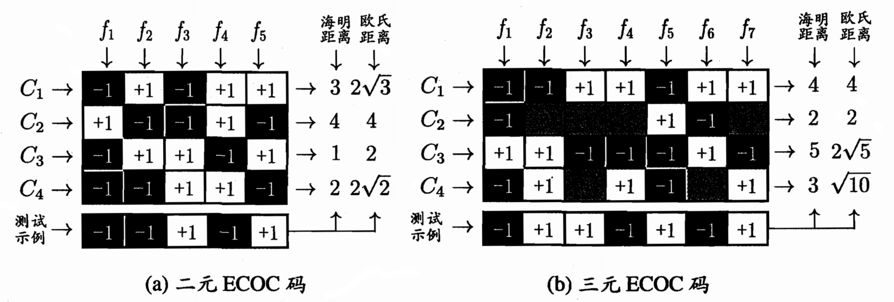

# 线性模型

## 基本形式

线性模型的一般形式为：

$$ f(\bm{x}) = w_1x_1 + w_2x_2 + \cdots + w_dx_d + b $$

向量形式为：

$$ f(\bm{x}) = \bm{w}^T\bm{x} + b $$

线性模型形式简单、易于建模，但却蕴涵着机器学习中一些重要的基本思想。许多功能更为强大的非线性模型可在线性模型的基础上通过引入层级结构或高维映射而得。此外，由于它直观表达了各属性在预测中的重要性，因此线性模型有很好的**可解释性**（comprehensibility）。

## 线性回归

### 一元线性回归

给定数据集 $D = \{(\bm{x}_1, y_1), (\bm{x}_2, y_2), \cdots, (\bm{x}_m, y_m)\}$，其中 $\bm{x}_i \in \mathbb{R}^d$，$y_i \in \mathbb{R}$，线性回归（linear regression）试图学得一个线性模型以尽可能准确地预测实值输出标记。我们先讨论一种最简单的情形：输入属性的数目只有一个。

对离散属性，若属性值间存在**序**（order）关系，可通过连续化将其转化为连续值；若属性值间不存在序关系，假定有 $k$ 个属性值，则通常转化为 $k$ 维向量，使用 one-shot 编码。

均方误差是回归任务中最常用的性能度量，因此我们可试图让均方误差最小化，即

$$
\begin{aligned}
    (w^*, b^*) &= \argmin_{w, b} \sum_{i=1}^m (f(x_i) - y_i)^2 \\
    &= \argmin_{w, b} \sum_{i=1}^m (y_i - wx_i - b)^2
\end{aligned}
$$

均方误差有非常好的几何意义，它对应了常用的欧几里得距离或简称**欧氏距离**（Euclidean distance）。基于均方误差最小化来进行模型求解的方法称为**最小二乘法**（least square method）。在线性回归中，最小二乘法就是试图找到一条直线，使所有样本到直线上的欧氏距离之和最小。

求解 $w$ 和 $b$ 使 $E_{(w, b)} = \sum_{i=1}^m (y_i - wx_i - b)^2$ 最小化的过程，称为线性回归模型的最小二乘**参数估计**（parameter estimation）。我们可将 $E_{(w, b)}$ 分别对 $w$ 和 $b$ 求导，得到

$$ \frac{\partial E_{(w, b)}}{\partial w} = 2 \sum_{i=1}^m x_i(wx_i + b - y_i) = 2 \left( w \sum_{i=1}^m x_i^2 + \sum_{i=1}^m (y_i - b)x_i \right) $$

$$ \frac{\partial E_{(w, b)}}{\partial b} = 2 \sum_{i=1}^m (wx_i + b - y_i) = 2 \left( mb - \sum_{i=1}^m (y_i - wx_i) \right) $$

然后令上式为零即可得到 $w$ 和 $b$ 最优解的**闭式**（closed-form）解

$$ w = \frac{m \sum_{i=1}^m x_i y_i - \sum_{i=1}^m x_i \sum_{i=1}^m y_i}{m \sum_{i=1}^m x_i^2 - \left( \sum_{i=1}^m x_i \right)^2} = \frac{\overline{xy} - \bar{x}\bar{y}}{\overline{x^2} - \bar{x}^2} $$

$$ b = \frac{1}{m} \sum_{i=1}^m (y_i - wx_i) = \bar{y} - w\bar{x} $$

### 多元线性回归

更一般的情况是样本由 $d$ 个属性描述，此时学习模型的过程被称为**多元线性回归**（multivariate linear regression）。

类似地，对于多元线性回归，我们可利用最小二乘法来对 $\bm{w}$ 和 $b$ 进行估计。为便于讨论，我们把 $\bm{w}$ 和 $b$ 吸收入向量形式 $\hat{\bm{w}} = (\bm{w}; b)$，把数据集 $D$ 表示为一个 $m \times (d+1)$ 大小的矩阵 $X$，其中每行对应于一个示例，该行前 $d$ 个元素对应于示例的 $d$ 个属性值，最后一个元素恒置为 1，即

$$
X = \begin{pmatrix}
    x_{11} & x_{12} & \cdots & x_{1d} & 1 \\
    x_{21} & x_{22} & \cdots & x_{2d} & 1 \\
    \vdots & \vdots & \ddots & \vdots & \vdots \\
    x_{m1} & x_{m2} & \cdots & x_{md} & 1
\end{pmatrix}
= \begin{pmatrix}
    \bm{x}_1^T & 1 \\
    \bm{x}_2^T & 1 \\
    \vdots & \vdots \\
    \bm{x}_m^T & 1
\end{pmatrix}
$$

再把标记也写成向量形式 $\bm{y} = (y_1; y_2; \cdots; y_m)$，则类似于一元线性回归，有

$$ \hat{\bm{w}}^* = \argmin_{\hat{\bm{w}}} (\bm{y} - X\hat{\bm{w}})^T (\bm{y} - X\hat{\bm{w}}) $$

令 $E_{\hat{\bm{w}}} = (\bm{y} - X\hat{\bm{w}})^T (\bm{y} - X\hat{\bm{w}})$，对 $\hat{\bm{w}}$ 求导得到

$$ \frac{\partial E_{\hat{\bm{w}}}}{\partial \hat{\bm{w}}} = 2 X^T (X\hat{\bm{w}} - \bm{y}) $$

令上式为零可得到最优解的闭式解，但由于涉及矩阵逆的计算，比一元线性回归要复杂一些。当 $X^T X$ 为满秩矩阵或正定矩阵时，令式为零可得

$$ \hat{\bm{w}}^* = (X^T X)^{-1} X^T \bm{y} $$

令 $\hat{\bm{x_i}} = (\bm{x}_i; 1)$，则最终学得的多元线性回归模型为

$$ f(\bm{x}) = \hat{\bm{x_i}}^T (X^T X)^{-1} X^T \bm{y} $$

然而，现实任务中 $X^T X$ 往往不是满秩矩阵。例如在许多任务中我们会遇到大量的变量，其数目甚至超过样例数，导致 $X$ 的列数多于行数，$X^T X$ 显然不满秩。此时可解出多个解，它们都能使均方误差最小化。选择哪一个解作为输出，将由学习算法的归纳偏好决定，常见的做法是引入**正则化**（regularization）项。

### 对数线性回归

线性模型虽简单，却有丰富的变化。假设我们认为示例所对应的输出标记是在指数尺度上变化，那就可将输出标记的对数作为线性模型逼近的目标，即

$$ \ln y = \bm{w}^T \bm{x} + b $$

这就是**对数线性回归**（log-linear regression），它实际上是在试图让 $e^{\bm{w}^T\bm{x} + b}$ 逼近 $y$。上式在形式上仍是线性回归，但实质上已是在求取输入空间到输出空间的非线性函数映射。这里的对数函数起到了将线性回归模型的预测值与真实标记联系起来的作用。

更一般地，考虑单调可微函数 $g(\cdot)$，令

$$ y = g^{-1}(\bm{w}^T \bm{x} + b) $$

这样得到的模型称为**广义线性模型**（generalized linear model），其中函数 $g(\cdot)$ 称为**联系函数**（link function）。对数线性回归是广义线性模型在 $g(\cdot) = \ln(\cdot)$ 时的特例。

## 对数几率回归

### 定义

考虑二分类任务，其输出标记 $y \in \{0, 1\}$，而线性回归模型产生的预测值 $z = \bm{w}^T\bm{x} + b$ 是实值，于是我们需将实值 $z$ 转换为 $0/1$ 值。最理想的是**单位阶跃函数**（unit-step function，也称 Heaviside 函数）

$$
y = \begin{cases}
    0, & z < 0 \\
    0.5, & z = 0 \\
    1, & z > 0
\end{cases}
$$

即若预测值 $z$ 大于零就判为正例，小于零则判为反例，预测值为临界值零则可任意判别。然而单位阶跃函数不连续，因此不能直接用作广义线性模型中的 $g(\cdot)$。于是我们希望找到能在一定程度上近似单位阶跃函数的**替代函数**（surrogate function），并希望它单调可微。**对数几率函数**（logistic function）正是这样一个常用的替代函数：

$$ y = \frac{1}{1 + e^{-z}} $$

将对数几率函数作为 $g^-(\cdot)$ 代入广义线性模型，得到

$$ y = \frac{1}{1 + e^{-(\bm{w}^T\bm{x} + b)}} $$

$$ \ln \frac{y}{1 - y} = \bm{w}^T\bm{x} + b $$

若将 $y$ 视为样本 $\bm{x}$ 作为正例的可能性，则 $1 - y$ 是其反例可能性，两者的比值 

$$ \frac{y}{1-y}$$

称为**几率**（odds），反映了作为正例的相对可能性。对几率取对数则得到**对数几率**（log odds，亦称 logit）

$$ \ln \frac{y}{1-y} $$

因此，使用对数几率函数的线性回归模型实际上是在用预测结果去逼近真实标记的对数几率，因此，其对应的模型称为**对数几率回归**（logistic regression，亦称 logit regression）。特别需注意到，虽然它的名字是“回归”，但实际却是一种分类学习方法。

对数几率回归的优点：

- 直接对分类可能性进行建模，无需事先假设数据分布，这样就避免了假设分布不准确所带来的问题
- 它不是仅预测出“类别”，而是可得到近似概率预测，这对许多需利用概率辅助决策的任务很有用
- 对率函数是任意阶可导的凸函数，有很好的数学性质，现有的许多数值优化算法都可直接用于求取最优解

### 求解

若将上式中的 $y$ 视为类后验概率估计 $p(y=1|\bm{x})$，则上式可重写为

$$ \ln \frac{p(y=1|\bm{x})}{p(y=0|\bm{x})} = \bm{w}^T\bm{x} + b $$

显然有

$$ p(y=1|\bm{x}) = \frac{e^{-(\bm{w}^T\bm{x} + b)}}{1 + e^{-(\bm{w}^T\bm{x} + b)}} $$

$$ p(y=0|\bm{x}) = \frac{1}{1 + e^{-(\bm{w}^T\bm{x} + b)}} $$

于是，我们可通过**极大似然法**（maximum likelihood method）来估计 $\bm{w}$ 和 $b$。给定数据集 $D = \{(\bm{x}_i, y_i)\}_{i=1}^m$，对率回归模型最大化**对数似然**（log-likelihood）

$$ \ell(\bm{w}, b) = \sum_{i=1}^m \ln p(y_i|\bm{x}_i; \bm{w}, b) $$

为了便于讨论，令 $\bm{\beta} = (\bm{w}, b)$，$\hat{\bm{x}} = (\bm{x}; 1)$，则 $w^T\bm{x} + b$ 可简写为 $\bm{\beta}^T\hat{\bm{x}}$，再令 $p_1(\hat{\bm{x}}; \bm{\beta}) = p(y=1|\hat{\bm{x}}; \bm{\beta})$，$p_0(\hat{\bm{x}}; \bm{w}) = p(y=0|\hat{\bm{x}}; \bm{\beta})$，则式 $\ell(\bm{w}, b)$ 中的似然项可重写为

$$
\begin{aligned}
    p(y_i|\hat{\bm{x}}_i; \bm{\beta}) &= y_i p_1(\hat{\bm{x}}_i; \bm{\beta}) + (1 - y_i) p_0(\hat{\bm{x}}_i; \bm{\beta}) \\
    &= \frac{y_i e^{-\bm{\beta}^T\hat{\bm{x}}_i} + 1 - y_i}{1 + e^{-\bm{\beta}^T\hat{\bm{x}}_i}} \\
    &= \begin{cases}
        1 / (1 + e^{-\bm{\beta}^T\hat{\bm{x}}_i}), & y_i = 0 \\
        e^{-\bm{\beta}^T\hat{\bm{x}}_i} / (1 + e^{-\bm{\beta}^T\hat{\bm{x}}_i}), & y_i = 1
    \end{cases} \\
    &= \frac{e^{-y_i\bm{\beta}^T\hat{\bm{x}}_i}}{1 + e^{-\bm{\beta}^T\hat{\bm{x}}_i}}
\end{aligned}
$$

因此，最大化 $\ell(\bm{w}, b)$ 等价于最小化

$$ \ell(\bm{\beta}) = -\sum_{i=1}^m \left( -y_i\bm{\beta}^T\hat{\bm{x}}_i + \ln(1 + e^{\bm{\beta}^T\hat{\bm{x}}_i}) \right) $$

该式是关于 $\bm{\beta}$ 的高阶可导连续凸函数，根据凸优化理论，经典的数值优化算法如**梯度下降法**（gradient descent method）或**牛顿法**（Newton method）都可求得其最优解。

以牛顿法为例，其第 $t+1$ 轮迭代解的更新公式为

$$ \bm{\beta}^{t+1} = \bm{\beta}^{t} - \left( \frac{\partial^2 \ell(\bm{\beta})}{\partial \bm{\beta} \partial \bm{\beta}^T} \right)^{-1} \frac{\partial \ell(\bm{\beta})}{\partial \bm{\beta}} $$

其中关于 $\bm{\beta}$ 的一阶、二阶导数分别为

$$ \frac{\partial \ell(\bm{\beta})}{\partial \bm{\beta}} = -\sum_{i=1}^m \hat{\bm{x}}_i(y_i - p_1(\hat{\bm{x}}_i; \bm{\beta})) $$

$$ \frac{\partial^2 \ell(\bm{\beta})}{\partial \bm{\beta} \partial \bm{\beta}^T} = \sum_{i=1}^m \hat{\bm{x}}_i\hat{\bm{x}}_i^T p_1(\hat{\bm{x}}_i; \bm{\beta})(1 - p_1(\hat{\bm{x}}_i; \bm{\beta})) $$

## 线性判别分析

### 定义

**线性判别分析**（Linear Discriminant Analysis，简称 LDA）是一种经典的线性学习方法，它在二分类问题上因最早由 Fisher 于 1936 年提出而又称为 Fisher 判别分析。

LDA 的思想非常朴素：给定训练样例集，设法将样例投影到一条直线上，使得同类样例的投影点尽可能接近、异类样例的投影点尽可能远离；在对新样本进行分类时，将其投影到同样的这条直线上，再根据投影点的位置来确定新样本的类别。

给定数据集 $D = \{(\bm{x}_1, y_1), (\bm{x}_2, y_2), \cdots, (\bm{x}_m, y_m)\}$，其中 $\bm{x}_i \in \mathbb{R}^d$，$y_i \in \{0, 1\}$，令

- $X_i$ 表示第 $i$ 类示例的集合
- $\bm{\mu}_i$ 表示第 $i$ 类示例的均值向量
- $\bm{\Sigma}_i$ 表示第 $i$ 类示例的协方差矩阵
- 若将数据投影到直线 $y = \bm{w}^T\bm{x}$ 上，则两类样本的中心在直线上的投影分别为 $\bm{w}^T\bm{\mu}_0$ 和 $\bm{w}^T\bm{\mu}_1$
- 若将所有样本点都投影到直线上，则两类样本的协方差分别为 $\bm{w}^T\bm{\Sigma}_0\bm{w}$ 和 $\bm{w}^T\bm{\Sigma}_1\bm{w}$
- 欲使同类样例的投影点尽可能接近，可以让同类样例投影点的协方差尽可能小，即 $\bm{w}^T\bm{\Sigma}_0\bm{w} + \bm{w}^T\bm{\Sigma}_1\bm{w}$ 尽可能小
- 欲使异类样例的投影点尽可能远离，可以让类中心之间的距离尽可能大，即 $\|\bm{w}^T\bm{\mu}_0 - \bm{w}^T\bm{\mu}_1\|_2^2$ 尽可能大

同时考虑二者，则可得到欲最大化的目标

$$
\begin{aligned}
    J &= \frac{\|\bm{w}^T\bm{\mu}_0 - \bm{w}^T\bm{\mu}_1\|_2^2}{\bm{w}^T\bm{\Sigma}_0\bm{w} + \bm{w}^T\bm{\Sigma}_1\bm{w}} \\
    &= \frac{\bm{w}^T(\bm{\mu}_0 - \bm{\mu}_1)(\bm{\mu}_0 - \bm{\mu}_1)^T\bm{w}}{\bm{w}^T(\bm{\Sigma}_0 + \bm{\Sigma}_1)\bm{w}}
\end{aligned}
$$

定义**类内散度矩阵**（within-class scatter matrix）

$$
\begin{aligned}
    S_w &= \Sigma_1 + \Sigma_2 \\
    &= \sum_{\bm{x} \in X_0} (\bm{x} - \bm{\mu}_0)(\bm{x} - \bm{\mu}_0)^T + \sum_{\bm{x} \in X_1} (\bm{x} - \bm{\mu}_1)(\bm{x} - \bm{\mu}_1)^T \\
\end{aligned}
$$

以及**类间散度矩阵**（between-class scatter matrix）

$$ S_b = (\bm{\mu}_0 - \bm{\mu}_1)(\bm{\mu}_0 - \bm{\mu}_1)^T $$

则上式可重写为

$$ J = \frac{\bm{w}^TS_b\bm{w}}{\bm{w}^TS_w\bm{w}} $$

这就是 LDA 欲最大化的目标，即 $S_b$ 与 $S_w$ 的**广义瑞利商**（generalized Rayleigh quotient）。

### 求解

注意到解与 $\bm{w}$ 的长度无关，只与其方向有关。不失一般性，令 $\bm{w}^TS_w\bm{w} = 1$，则目标等价于

$$ \min_{\bm{w}} -\bm{w}^TS_b\bm{w} $$

$$ \text{s.t.} \quad \bm{w}^TS_w\bm{w} = 1 $$

对该目标使用拉格朗日乘子法，定义拉格朗日乘子 $\lambda$，可以得到

$$ S_b\bm{w} = \lambda S_w\bm{w} $$

注意到 $S_b\bm{w}$ 的方向恒为 $\bm{\mu}_0 - \bm{\mu}_1$，不妨令 $S_b\bm{w} = \lambda(\bm{\mu}_0 - \bm{\mu}_1)$，代入上式即得到

$$ \bm{w} = S_w^{-1}(\bm{\mu}_0 - \bm{\mu}_1) $$

考虑到数值解的稳定性，在实践中通常是对 $S_w$ 进行奇异值分解，即 $S_w = U\Sigma V^T$，这里 $\Sigma$ 是一个实对角矩阵，其对角线上的元素是 $S_w$ 的奇异值，然后再由 $S_w^{-1} = V\Sigma^{-1}U^T$ 得到 $S_w^{-1}$。

值得一提的是，LDA 可从贝叶斯决策理论的角度来阐释，并可证明，当两类数据同先验、满足高斯分布且协方差相等时，LDA 可达到最优分类。

### 多分类 LDA

LDA 可以推广到多分类任务中。假定存在 $N$ 个类，且第 $i$ 类示例数为 $m_i$，我们先定义**全局散度矩阵**

$$
\begin{aligned}
    S_t &= S_b + S_w \\
    &= \sum_{i=1}^m (\bm{x_i} - \bm{\mu})(\bm{x_i} - \bm{\mu})^T
\end{aligned}
$$

其中 $\bm{\mu}$ 是所有示例的均值向量。将类内散度矩阵 $S_w$ 重定义为每个类别的散度矩阵之和，即

$$
\begin{aligned}
    S_w &= \sum_{i=1}^N S_{w_i} \\
    &= \sum_{i=1}^N \sum_{\bm{x} \in X_i} (\bm{x} - \bm{\mu}_i)(\bm{x} - \bm{\mu}_i)^T
\end{aligned}
$$

类间散度矩阵 $S_b$ 就是

$$
\begin{aligned}
    S_b &= S_t - S_w \\
    &= \sum_{i=1}^N m_i (\bm{\mu}_i - \bm{\mu})(\bm{\mu}_i - \bm{\mu})^T
\end{aligned}
$$

显然，多分类 LDA 可以有多种实现方法：使用 $S_b$、$S_w$、$S_t$ 三者中的任何两个即可。常见的一种实现是采用优化目标

$$ \max_{W} \frac{\text{tr}(W^TS_bW)}{\text{tr}(W^TS_wW)} $$

其中，$W \in \mathbb{R}^{d \times (N-1)}$，$\text{tr}(\cdot)$ 表示矩阵的迹。式中的目标函数可通过如下广义特征值问题求解

$$ S_bW = \lambda S_wW $$

$W$ 的闭式解则是 $S_w^{-1}S_b$ 的 $N-1$ 个最大广义特征值所对应的特征向量组成的矩阵。

若将 $W$ 视为一个投影矩阵，则多分类 LDA 将样本投影到 $N-1$ 维空间，$N-1$ 通常远小于数据原有的属性数。于是，可通过这个投影来减小样本点的维数，且投影过程中使用了类别信息，因此 LDA 也常被视为一种经典的**监督降维技术**。

## 多分类学习

现实中常遇到多分类学习任务。有些二分类学习方法（例如 LDA 推广）可直接推广到多分类，但在更多情形下，我们是基于一些基本策略，利用二分类学习器来解决多分类问题。

不失一般性，考虑 $N$ 个类别 $C_1, C_2, \cdots, C_N$，多分类学习的基本思路是**拆解法**，即将多分类任务拆为若干个二分类任务求解。具体来说，先对问题进行拆分，然后为拆出的每个二分类任务训练一个分类器；在测试时，对这些分类器的预测结果进行集成以获得最终的多分类结果。这里的关键是**如何对多分类任务进行拆分**，以及**如何对多个分类器进行集成**。

最经典的拆分策略有三种：**一对一**（One vs. One，简称 OvO）、**一对其余**（One vs. Rest，简称 OvR）和**多对多**（Many vs. Many，简称 MvM）。

### OvO 和 OvR

- OvO
    - 拆分阶段：将 $N$ 个类别两两配对，从而产生 $N(N-1)/2$ 个二分类任务
    - 测试阶段：新样本将同时提交给所有分类器，于是我们将得到 $N(N-1)/2$ 个分类结果，把被预测得最多的类别作为最终分类结果
    - 优点：OvO 的每个分类器仅需用到两个类的样例，因此在类别很多时，OvO 的**训练时间开销**通常比 OvR 更小
- OvR
    - 拆分阶段：每次将一个类的样例作为正例、所有其他类的样例作为反例来训练 $N$ 个分类器
    - 测试阶段：若仅有一个分类器预测为正类，则对应的类别标记作为最终分类结果；若有多个分类器预测为正类，则通常考虑各分类器的预测置信度，选择置信度最大的类别标记作为分类结果
    - 优点：OvR 只需训练 $N$ 个分类器，**存储开销和测试时间开销**通常比 OvO 更小

### MvM

MvM 是将若干个类作为正类、若干个其他类作为反类。显然，OvO 和 OvR 是 MvM 的特例。

MvM 的正、反类构造必须有特殊的设计，不能随意选取。这里我们介绍一种最常用的 MvM 技术：**纠错输出码**（Error Correcting Output Codes，简称 ECOC）。

ECOC 是将编码的思想引入类别拆分，并尽可能在解码过程中具有容错性。ECOC 工作过程主要分为两步：

- 编码：对 $N$ 个类别做若干次划分，每次划分将一部分类别划为正类，一部分划为反类，从而形成一个二分类训练集；这样一共产生 $M$ 个训练集，可训练出 $M$ 个分类器
- 解码：$M$ 个分类器分别对测试样本进行预测，这些预测标记组成一个编码。将这个预测编码与每个类别各自的编码进行比较，返回其中距离最小的类别作为最终预测结果

类别划分通过**编码矩阵**（coding matrix）指定。编码矩阵有多种形式，常见的主要有**二元码**和**三元码**。前者将每个类别分别指定为正类和反类，后者在正、反类之外，还可指定“停用类”。

  

一般来说，对同一个学习任务，ECOC 编码越长，纠错能力越强。然而，编码越长，意味着所需训练的分类器越多，计算、存储开销都会增大；另一方面，对有限类别数，可能的组合数目是有限的，码长超过一定范围后就失去了意义。

对于同等长度的编码，理论上来说，任意两个类别之间的编码距离越远，则纠错能力越强。因此，在码长较小时可根据这个原则计算出理论最优编码。然而，码长稍大一些就难以有效地确定最优编码，事实上这是 NP 难问题。不过，通常我们并不需获得理论最优编码，因为非最优编码在实践中也能取得不错的效果。另一方面，并不是编码的理论性质越好，分类性能就越好，因为机器学习问题涉及很多因素，例如将多个类拆解为两个“类别子集”，不同拆解方式所形成的两个类别子集的区分难度往往不同，即其导致的二分类问题的难度不同；于是，一个理论纠错性质很好、但导致的二分类问题较难的编码，与另一个理论纠错性质差一些、但导致的二分类问题较简单的编码，最终产生的模型性能孰强孰弱很难说。

## 类别不平衡问题

前面介绍的分类学习方法都有一个共同的基本假设，即不同类别的训练样例数目相当。如果不同类别的训练样例数目差别很大，则会对学习过程造成困扰。例如有 998 个反例，但正例只有 2 个，那么学习方法只需返回一个永远将新样本预测为反例的学习器，就能达到 99.8% 的精度；然而这样的学习器往往没有价值，因为它不能预测出任何正例。**类别不平衡**（class-imbalance）就是指分类任务中不同类别的训练样例数目差别很大的情况。

从线性分类器的角度讨论容易理解，在我们用 $y = \bm{w}^T\bm{x} + b$ 对新样本 $\bm{x}$ 进行分类时，事实上是在用预测出的 $y$ 值与一个阈值进行比较，例如通常在 $y > 0.5$ 时判别为正例，否则为反例。$y$ 实际上表达了正例的可能性，几率则反映了正例可能性与反例可能性之比值，阈值设置为 0.5 恰表明分类器认为真实正、反例可能性相同。然而，当训练集中正、反例的数目不同时，令 $m^+$ 表示正例数目，$m^-$ 表示反例数目，则观测几率是 $m^+/m^-$，由于我们通常假设训练集是真实样本总体的无偏采样，因此观测几率就代表了真实几率。于是，只要分类器的预测几率高于观测几率就应判定为正例，即

$$ \text{若 } \frac{y}{1-y} > \frac{m^+}{m^-} \text{ 则预测为正例} $$

这就是类别不平衡学习的一个基本策略——**再缩放**（rescaling）。

再缩放的思想虽简单，但实际操作却并不平凡，主要因为“训练集是真实样本总体的无偏采样”这个假设往往并不成立，也就是说，我们未必能有效地基于训练集观测几率来推断出真实几率。现有技术大体上有三类做法：

- **欠采样**（undersampling）：去除反例使得正、反例数目接近，然后再进行学习
- **过采样**（oversampling）：增加一些正例使得正、反例数目接近，然后再进行学习
- **阈值移动**（threshold-moving）：直接基于原始训练集进行学习，但在用训练好的分类器进行预测时，将式 $\frac{y}{1-y} > \frac{m^+}{m^-}$ 嵌入到其决策过程中

