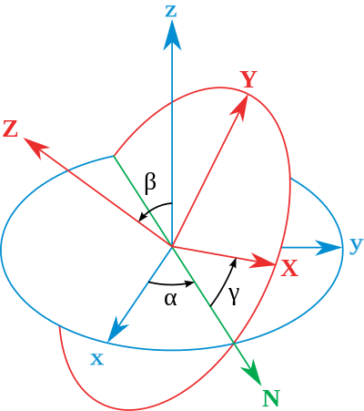
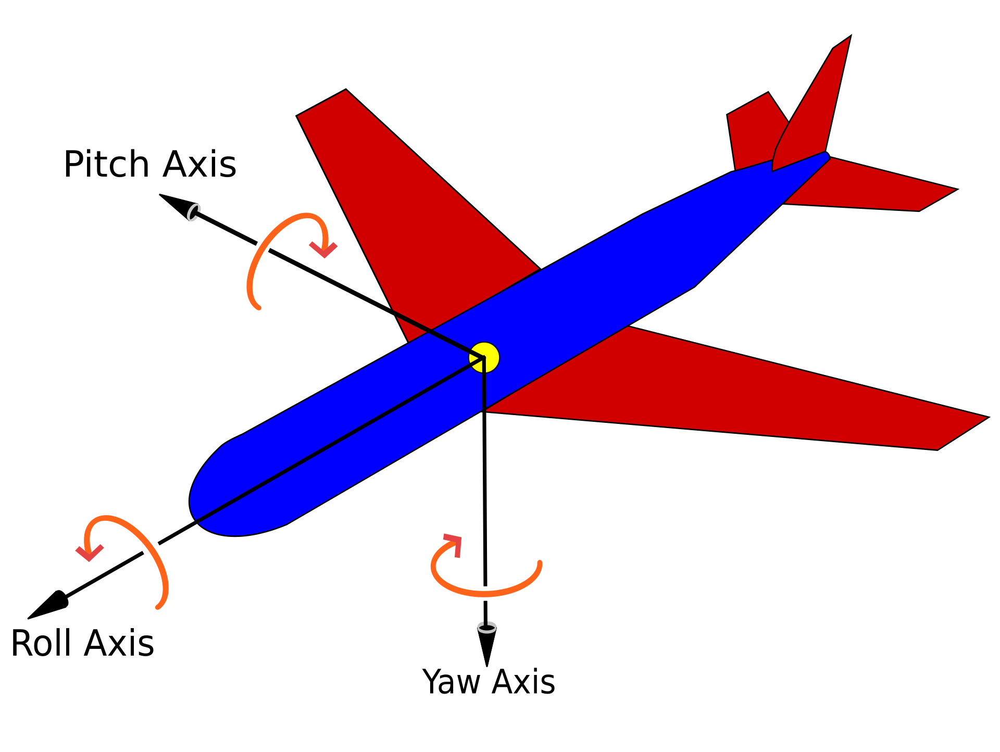
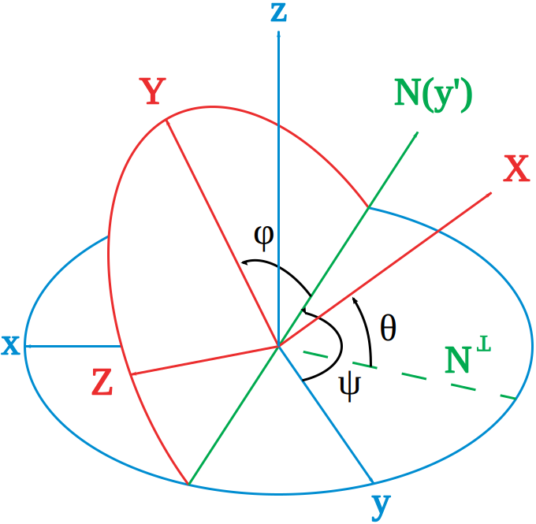

# 变换
## 2D线性变换

线性变换是能够用矩阵直接表示的变换，包括缩放、反射、剪切、旋转等，平移不是线性变换。

2D线性变换的基本形式是：

$$
\begin{pmatrix} x' \\ y' \end{pmatrix}
= \begin{pmatrix}
    a & b \\
    c & d
\end{pmatrix}
\begin{pmatrix} x \\ y \end{pmatrix}
$$

### 缩放
- 均匀缩放：

$$
\begin{pmatrix} x' \\ y' \end{pmatrix}
= \begin{pmatrix}
    s & 0 \\
    0 & s
\end{pmatrix}
\begin{pmatrix} x \\ y \end{pmatrix}
$$

- 非均匀缩放：

$$
\begin{pmatrix} x' \\ y' \end{pmatrix}
= \begin{pmatrix}
    s_x & 0 \\
    0 & s_y
\end{pmatrix}
\begin{pmatrix} x \\ y \end{pmatrix}
$$

### 反射
- 水平反射矩阵：

$$
\begin{pmatrix}
    -1 & 0 \\
    0 & 1
\end{pmatrix}
$$

### 剪切
- 水平剪切矩阵：

$$
\begin{pmatrix}
    1 & a \\
    0 & 1
\end{pmatrix}
$$

- 当 $y=0$ 时水平偏移为 $0$，$y=1$ 时水平偏移为 $a$。

### 旋转
- 绕原点逆时针旋转 $\theta$ 的矩阵：

$$
R(\theta) =
\begin{pmatrix}
    \cos\theta & -\sin\theta \\
    \sin\theta & \cos\theta
\end{pmatrix}
$$

## 齐次坐标
### 齐次坐标的引入

为了能够用矩阵乘法表示平移，引入齐次坐标，为普通2D点和2D向量添加一个新的维度：

- **2D点**：$(x, y, 1)^T$
- **2D向量**：$(x, y, 0)^T$
- **操作规则**：
    - 向量 + 向量 = 向量
    - 点 - 点 = 向量
    - 点 + 向量 = 点
    - 点 + 点 = 点（需归一化）

### 仿射变换的矩阵表示

仿射变换就是线性变换和平移的组合，可以用 $3 \times 3$ 矩阵表示：

$$
\begin{pmatrix} x' \\ y' \\ 1 \end{pmatrix}
= \begin{pmatrix}
    a & b & t_x \\
    c & d & t_y \\
    0 & 0 & 1
\end{pmatrix}
\begin{pmatrix} x \\ y \\ 1 \end{pmatrix}
$$

## 3D旋转
### 欧拉角
#### 基本概念

- 绕 $x$ 轴旋转 $\alpha$：

$$
R_x(\alpha) =
\begin{pmatrix}
    1 & 0 & 0 \\
    0 & \cos\alpha & -\sin\alpha \\
    0 & \sin\alpha & \cos\alpha
\end{pmatrix}
$$

- 绕 $y$ 轴旋转 $\beta$：

$$
R_y(\beta) =
\begin{pmatrix}
    \cos\beta & 0 & \sin\beta \\
    0 & 1 & 0 \\
    -\sin\beta & 0 & \cos\beta
\end{pmatrix}
$$

- 绕 $z$ 轴旋转 $\gamma$：

$$
R_z(\gamma) =
\begin{pmatrix}
    \cos\gamma & -\sin\gamma & 0 \\
    \sin\gamma & \cos\gamma & 0 \\
    0 & 0 & 1
\end{pmatrix}
$$

以 $R_z$ 为例，其效果相当于沿 $z$ 轴负方向看去（从上往下看），物体逆时针旋转 $\alpha$，符合右手定则。

**欧拉角**就是将一个旋转分解为三个绕坐标轴的旋转，可以细分为经典欧拉角和泰特布莱恩角。经典欧拉角和泰特布莱恩角的区别在于旋转次序不同：

- **经典欧拉角**（Proper Euler angles）：旋转次序有 $ZXZ$、$ZYZ$、$XYX$、$YXY$、$YZY$、$XZX$ 六种
- **泰特布莱恩角**（Tait–Bryan angles）：旋转次序有 $XYZ$、$XZY$、$YXZ$、$YZX$、$ZXY$、$ZYX$ 六种

经典欧拉角最常见的是 $ZXZ$ 顺规，即先绕 $z$ 轴旋转 $\alpha$，再绕新生成的 $x$ 轴旋转 $\beta$，最后绕新生成的 $z$ 轴旋转 $\gamma$，如下图所示：

  

  

泰特布莱恩角最常见的是 $ZXY$ 顺规，$\psi$、$\theta$、$\varphi$ 分别对应着 yaw 偏航角、pitch 俯仰角和 roll 滚转角，用于飞行器的姿态控制：

  

  

#### 内旋和外旋

- **内旋**（Intrinsic Rotation）：围绕物体自身的坐标系旋转，物体的坐标系会随之改变
- **外旋**（Extrinsic Rotation）：围绕固定的世界坐标系旋转

对于 $XYZ$ 顺规的内旋，设点 $P$ 的坐标为 $p$，先绕初始 $x$ 轴旋转 $\alpha$ 得到

$$ p' = R_x(\alpha) p $$

然后绕新生成的 $y$ 轴旋转 $\beta$，这等价于先将物品坐标系逆变换回世界坐标系，再绕世界坐标系的 $y$ 轴旋转 $\beta$，最后再变换回物品坐标系：

$$
\begin{aligned}
    p'' &= R_x(\alpha) \cdot R_y(\beta) \cdot R_x(\alpha)^{-1} p' \\
    &= R_x(\alpha)R_y(\beta) p
\end{aligned}
$$

最后绕新生成的 $z$ 轴旋转 $\gamma$，同上类似可以得到

$$
\begin{aligned}
    p''' &= R_x(\alpha)R_y(\beta) \cdot R_z(\gamma) \cdot [R_x(\alpha)R_y(\beta)]^{-1} p'' \\
    &= R_x(\alpha)R_y(\beta)R_z(\gamma) p
\end{aligned}
$$

$p'''$ 就是三次内旋后点 $P$ 在世界坐标系中的坐标，与 $ZYX$ 顺规的外旋等价。

由此可见，**内旋与外旋的绕轴旋转顺序相反时，两者等效**。

#### 万向节死锁

在 Unity 中，欧拉角采取的是 $ZXY$ 顺规的外旋，如果绕 $x$ 轴旋转的角度为 $90^\circ$，那么物品坐标系的 $z$ 轴就会和世界坐标系的 $y$ 轴重合，此时再绕世界坐标系的 $y$ 轴旋转，效应就与最开始绕 $z$ 轴旋转一样，少了一个自由度。

这就是**万向节死锁**（Gimbal Lock）问题，即当任意两个旋转轴重合时，就会失去一个自由度，使物体无法绕某一方向旋转。万向节死锁是由欧拉角的内在局限性导致的。

即使在没有万向锁的情况下，欧拉角的表示也不是唯一的，**三维空间中每个旋转都可以用至少两个欧拉角来表示**。总的来说，欧拉角的歧义性主要源于其定义方式，即通过三个连续的旋转来描述最终的旋转。这些旋转是相对于不同的轴进行的，因此旋转的顺序和中间的旋转状态都会影响最终的结果。

### 轴角表示

**轴角表示**（Axis-Angle Representation）是另一种用于描述三维空间中刚体旋转的方法。它通过一个单位向量（旋转轴）和一个标量（旋转角度）来唯一地表示一个旋转。

给定一个向量 $\mathbf{v}$，要将其绕旋转轴 $\mathbf{n}$ 旋转角度 $\theta$，可以使用**罗德里格斯公式**（Rodrigues' Rotation Formula）来计算：

$$ \mathbf{v}' = \cos\theta \mathbf{v} + (1 - \cos\theta)(\mathbf{n} \cdot \mathbf{v}) \mathbf{n} + \sin\theta \mathbf{n} \times \mathbf{v} $$

首先，可以将 $\mathbf{v}$ 分解为平行于 $\mathbf{n}$ 的分量 $\mathbf{v_{\parallel}}$ 和垂直于 $\mathbf{n}$ 的分量 $\mathbf{v_{\perp}}$ 两部分：

$$ \mathbf{v_{\parallel}} = (\mathbf{n} \cdot \mathbf{v}) \mathbf{n} $$

$$ \mathbf{v_{\perp}} = - \mathbf{n} \times (\mathbf{n} \times \mathbf{v}) = \mathbf{v} - \mathbf{v_{\parallel}} $$

其中，$\mathbf{n} \times \mathbf{v}$ 可以看作将 $\mathbf{v_{\perp}}$ 逆时针旋转 $90^\circ$，$\mathbf{n} \times (\mathbf{n} \times \mathbf{v})$ 可以看作将 $\mathbf{v_{\perp}}$ 逆时针旋转 $180^\circ$。因此，将 $\mathbf{v_{\perp}}$ 逆时针旋转 $\theta$ 后可得：

$$ \mathbf{v_{\perp}}' = \cos\theta \mathbf{v_{\perp}} + \sin\theta \mathbf{n} \times \mathbf{v} $$

然后可得：

$$
\begin{aligned}
    v' &= \mathbf{v_{\parallel}} + \mathbf{v_{\perp}}' \\
    &= (\mathbf{n} \cdot \mathbf{v}) \mathbf{n} + \cos\theta \mathbf{v_{\perp}} + \sin\theta \mathbf{n} \times \mathbf{v} \\
    &= \mathbf{v_{\parallel}} + \cos\theta (\mathbf{v} - \mathbf{v_{\parallel}}) + \sin\theta \mathbf{n} \times \mathbf{v} \\
    &= \cos\theta \mathbf{v} + (1 - \cos\theta)(\mathbf{n} \cdot \mathbf{v}) \mathbf{n} + \sin\theta \mathbf{n} \times \mathbf{v}
\end{aligned}
$$

对应的旋转矩阵就是：

$$ R(\mathbf{n}, \theta) = \cos\theta \: \mathbf{I} + (1 - \cos\theta) \mathbf{n} \mathbf{n}^T + \sin\theta \: \mathbf{N} $$

$$
N = \begin{pmatrix}
    0 & -n_z & n_y \\
    n_z & 0 & -n_x \\
    -n_y & n_x & 0
\end{pmatrix}
$$

### 四元数
#### 基本性质

**四元数**（Quaternion）是一种用于表示旋转的数学工具，它可以看作是复数的推广，由一个实部和三个虚部组成。四元数的基本形式是：

$$ q = w + xi + yj + zk = (w, \mathbf{v}) $$

其中，$w$ 是实部，$x, y, z$ 是虚部，$\mathbf{v} = (x, y, z)$。

虚部的乘法规则是：

$$
i^2 = j^2 = k^2 = ijk = -1 \\
ij = k, \quad jk = i, \quad ki = j \\
ji = -k, \quad kj = -i, \quad ik = -j
$$

四元数乘法的向量形式是：

$$ q_1 q_2 = (w_1w_2 - \mathbf{v_1} \cdot \mathbf{v_2}, \ w_1\mathbf{v_2} + w_2\mathbf{v_1} + \mathbf{v_1} \times \mathbf{v_2}) $$

四元数乘法的矩阵形式是：

$$
\begin{pmatrix}
    w_1 & -x_1 & -y_1 & -z_1 \\
    x_1 & w_1 & z_1 & -y_1 \\
    y_1 & -z_1 & w_1 & x_1 \\
    z_1 & y_1 & -x_1 & w_1
\end{pmatrix}
\begin{pmatrix}
    w_2 \\ x_2 \\ y_2 \\ z_2
\end{pmatrix}
= \begin{pmatrix}
    w_1w_2 - x_1x_2 - y_1y_2 - z_1z_2 \\
    w_1x_2 + x_1w_2 + y_1z_2 - z_1y_2 \\
    w_1y_2 - x_1z_2 + y_1w_2 + z_1x_2 \\
    w_1z_2 + x_1y_2 - y_1x_2 + z_1w_2
\end{pmatrix}
$$

此外还有几个重要的性质：

- 四元数的模：$\|q\| = \sqrt{w^2 + x^2 + y^2 + z^2}$
- 四元数的共轭：$q^* = (w, -\mathbf{v})$
- 四元数的逆：$q^{-1} = q^*/\|q\|^2$，当 $q$ 是单位四元数时，$q^{-1} = q^*$
- 共轭和逆的性质：$(pq)^* = q^*p^*$，$(pq)^{-1} = q^{-1}p^{-1}$
- 四元数运算满足结合律和分配律，不满足交换律

#### 旋转表示

令 $ijk$ 组成的空间为三维空间，实部 $w$ 为第四维，垂直于三维空间。

现在观察 $i$ 这个虚部，它左乘 $jk$ 平面中的向量相当于让其绕 $i$ 轴逆时针旋转 $90^\circ$，右乘相当于绕 $i$ 轴顺时针旋转 $90^\circ$，而乘以 $1i$ 复平面中的向量则相当于让其旋转 $90^\circ$（满足交换律，左乘和右乘是同一方向）。

推广到单位向量 $\mathbf{v} = xi + yj + zk$，可以类似地得到，$\mathbf{v}$ 左乘三维空间中垂直于 $\mathbf{v}$ 的向量相当于让其绕 $\mathbf{v}$ 逆时针旋转 $90^\circ$，右乘相当于绕 $\mathbf{v}$ 顺时针旋转 $90^\circ$，而乘以 $1\mathbf{v}$ 复平面中的向量则相当于让其旋转 $90^\circ$。

再推广到任意单位四元数 $q = \cos\theta + \mathbf{v} \sin\theta$，令其左乘 $p$，可以得到：

- 将 $\mathbf{v}$ 看作一个新的虚部，参考复数乘法的几何含义，$q$ 乘以 $p$ 在 $1\mathbf{v}$ 复平面中的分量相当于让其旋转 $\theta$
- 对于 $p$ 在三维空间中的分量 $\mathbf{u}$，由之前的结论可得 $\mathbf{v} \cdot \mathbf{u}$ 是 $\mathbf{u}$ 在三维空间中绕 $\mathbf{v}$ 逆时针旋转 $90^\circ$ 的结果，因此 $q \cdot \mathbf{u} = \mathbf{u} \cos\theta + \mathbf{v} \cdot \mathbf{u} \sin\theta$ 是 $\mathbf{u}$ 在三维空间中绕 $\mathbf{v}$ 逆时针旋转 $\theta$ 的结果

同理，$q^{-1}$ 右乘 $p$，相当于 $p$ 的虚部分量绕 $\mathbf{v}$ 逆时针旋转 $\theta$，在 $1\mathbf{v}$ 复平面中的分量反方向旋转 $\theta$。

综上，$qpq^{-1}$ 或 $qpq^*$ 相当于 $p$ 在三维空间中绕 $\mathbf{v}$ 逆时针旋转 $2\theta$，在 $1\mathbf{v}$ 复平面中的旋转抵消。

此时对于一个三维旋转，我们可以将要旋转的向量写成 $p = (0, \mathbf{v})$，将旋转表示为 $q = (\cos \frac{\theta}{2}, \mathbf{n} \sin \frac{\theta}{2})$，通过计算 $qpq^{-1}$ 或 $qpq^*$ 来得到旋转结果 $p' = (0, \mathbf{v'})$。

## 观测变换

**观测变换**（Viewing Transformation）是将世界坐标系中的物体转换到观察者的坐标系中的过程，包括：

- 视图变换：将观察者的位置和方向转换到原点
- 投影变换：将裁剪空间变换为 NDC（Normalized Device Coordinates，归一化设备坐标）空间，分为正交投影和透视投影

### 视图/相机变换

在三维计算机图形学中，为了模拟观察者的视角，需要将世界坐标系中的对象转换为相对于观察者的坐标系。视图变换通过平移和旋转相结合的方式，使观察者位于原点，观察方向指向负 $Z$ 轴，上方向指向正 $Y$ 轴，同时移动其他所有物体。

设相机的位置为 $\vec{e}$，看向的方向为 $\hat{g}$，上方向为 $\hat{t}$，则需要：

- 将 $\vec{e}$ 平移到原点
- 将 $\hat{g}$ 旋转到 $-Z$
- 将 $\hat{t}$ 旋转到 $Y$
- 将 $\hat{g} \times \hat{t}$ 旋转到 $X$

平移矩阵显然是：

$$
T_{view} = \begin{pmatrix}
    1 & 0 & 0 & -e_x \\
    0 & 1 & 0 & -e_y \\
    0 & 0 & 1 & -e_z \\
    0 & 0 & 0 & 1
\end{pmatrix}
$$

由于直接求旋转矩阵较为困难，我们可以先求出该旋转矩阵的逆矩阵，再将其转置即可：

$$
R_{view}^{-1} = \begin{pmatrix}
    x_{\hat{g}\times\hat{t}} & x_{\hat{t}} & x_{-\hat{g}} & 0 \\
    y_{\hat{g}\times\hat{t}} & y_{\hat{t}} & y_{-\hat{g}} & 0 \\
    z_{\hat{g}\times\hat{t}} & z_{\hat{t}} & z_{-\hat{g}} & 0 \\
    0 & 0 & 0 & 1
\end{pmatrix}
\ \Rightarrow \
R_{view} = \begin{pmatrix}
    x_{\hat{g}\times\hat{t}} & y_{\hat{g}\times\hat{t}} & z_{\hat{g}\times\hat{t}} & 0 \\
    x_{\hat{t}} & y_{\hat{t}} & z_{\hat{t}} & 0 \\
    x_{-\hat{g}} & y_{-\hat{g}} & z_{-\hat{g}} & 0 \\
    0 & 0 & 0 & 1
\end{pmatrix}
$$

然后将 $R_{view}$ 和 $T_{view}$ 相乘即可得到视图变换矩阵：

$$ M_{view} = R_{view} T_{view} $$

### 投影变换
#### 正交投影

**正交投影**（Orthographic Projection）通过平移和缩放，将一个 $[l, r] \times [b, t] \times [f, n]$ 的长方体（Cuboid）映射到 $[-1, 1]^3$ 的标准立方体（Canonical Cube）。

正交投影直接丢弃 $Z$ 坐标，投影后的物体大小不会随着距离的增加而变化，易得投影矩阵为：

$$
\begin{aligned}
    M_{ortho} &= M_{scale}M_{translate} \\
    &= \begin{pmatrix}
        \frac{2}{r-l} & 0 & 0 & 0 \\
        0 & \frac{2}{t-b} & 0 & 0 \\
        0 & 0 & \frac{2}{n-f} & 0 \\
        0 & 0 & 0 & 1
    \end{pmatrix}
    \begin{pmatrix}
        1 & 0 & 0 & -\frac{r+l}{2} \\
        0 & 1 & 0 & -\frac{t+b}{2} \\
        0 & 0 & 1 & -\frac{n+f}{2} \\
        0 & 0 & 0 & 1
    \end{pmatrix} \\
    &= \begin{pmatrix}
        \frac{2}{r-l} & 0 & 0 & -\frac{r+l}{r-l} \\
        0 & \frac{2}{t-b} & 0 & -\frac{t+b}{t-b} \\
        0 & 0 & \frac{2}{n-f} & -\frac{n+f}{n-f} \\
        0 & 0 & 0 & 1
    \end{pmatrix}
\end{aligned}
$$

#### 透视投影

**透视投影**（Perspective Projection）先通过透视除法将视锥体（Frustum）压缩为一个长方体，再通过正交投影将长方体映射到标准立方体。

假设视锥体的近裁剪面的距离为 $n$，远裁剪面的距离为 $f$，为了使视线上的每个点都投影在近裁剪面的相同位置，需要使：

$$ x' = \frac{n}{z}x, \quad y' = \frac{n}{z}y $$

在齐次坐标中，就是要做到：

$$
\begin{pmatrix} x \\ y \\ z \\ 1 \\ \end{pmatrix}
\Rightarrow 
\begin{pmatrix} nx \\ ny \\ \text{unknown} \\ z \\ \end{pmatrix}
$$

为了使近裁剪面和远裁剪面之间的点在压缩后仍在近裁剪面和远裁剪面之间，需要保证近裁剪面和远裁剪面上的点的 $z$ 坐标不变，然后易得第一步的矩阵为：

$$
M_{persp \rightarrow ortho} = 
\begin{pmatrix}
    n & 0 & 0 & 0 \\
    0 & n & 0 & 0 \\
    0 & 0 & n+f & -nf \\
    0 & 0 & 1 & 0
\end{pmatrix}
$$

最后可得透视投影矩阵为：

$$
\begin{aligned}
    M_{persp} &= M_{ortho} M_{persp \rightarrow ortho} \\
    &= \begin{pmatrix}
        \frac{2}{r-l} & 0 & 0 & -\frac{r+l}{r-l} \\
        0 & \frac{2}{t-b} & 0 & -\frac{t+b}{t-b} \\
        0 & 0 & \frac{2}{n-f} & -\frac{n+f}{n-f} \\
        0 & 0 & 0 & 1
    \end{pmatrix}
    \begin{pmatrix}
        n & 0 & 0 & 0 \\
        0 & n & 0 & 0 \\
        0 & 0 & n+f & -nf \\
        0 & 0 & 1 & 0
    \end{pmatrix} \\
    &= \begin{pmatrix}
        \frac{2n}{r-l} & 0 & \frac{l+r}{l-r} & 0 \\
        0 & \frac{2n}{t-b} & \frac{b+t}{b-t} & 0 \\
        0 & 0 & \frac{n+f}{n-f} & -\frac{2fn}{f-n} \\
        0 & 0 & 1 & 0
    \end{pmatrix}
\end{aligned}
$$
