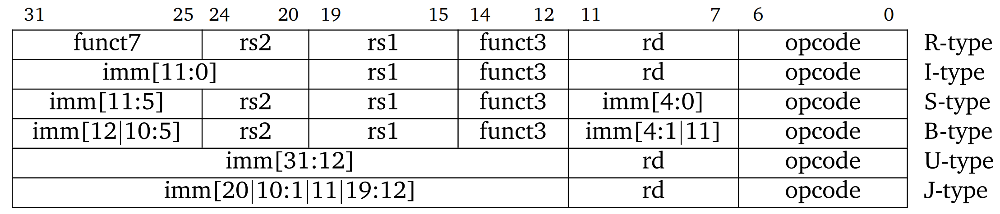
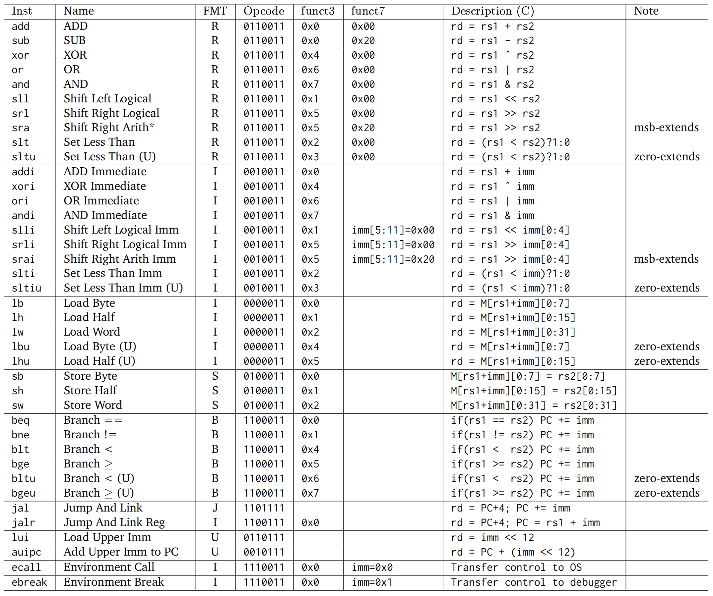

# 指令：计算机的语言

这里主要讲的是 RISC-V 指令集，若要了解 x86 指令集，可以参考[另一篇笔记](https://zhroyn.github.io/MyNotes/%E5%85%B6%E4%BB%96/8086Note.html)。


## 指令集设计原则

1. Simplicity favors regularity，简单源自规整
    - 指令包含3个操作数
    - 基本 RISC-V ISA 是定长的 32-bit 的指令
2. Smaller is faster，越少越快
    - 寄存器个数一般不超过 32 个
3. Make the common case fast，让常见的情况快
    - 小常数是常见的，针对立即数的操作避免了额外的加载操作
    - 经常有 0 参与计算，因此专门将零存在 `x0` 中
4. Good design demands good compromises，好的设计需要好的折中
    - 例如，为了扩大立即数的范围，牺牲了操作码的位数


<br>

## 寄存器

RISC-V 有 32 个 64 位的通用寄存器，分别用 `x0` 到 `x31` 表示，也可以使用其别名，具体为：

- `x0` 一直为 0 (zero)
- `x1` 返回地址寄存器 (Return Address, ra)
- `x2` 栈指针 (Stack Pointer, sp)
- `x3` 全局指针 (Global Pointer, gp)
- `x4` 线程指针 (Thread Pointer, tp)
- `x5-x7` 临时寄存器 (Temporaries, t0-t2)
- `x8` 保留寄存器 (Frame Pointer/Saved, fp/s0)
- `x9` 保留寄存器 (Saved, s1)
- `x10-x17` 参数/结果寄存器 (Arguments, a0-a7)
- `x18-x27` 保留寄存器 (Saved, s2-s11)
- `x28-x31` 临时寄存器 (Temporaries, t3-t6)

其中 ra, sp, gp, tp 也是保留寄存器。保留寄存器需要在被调用时将原来的值保存到栈中，并在之后恢复，而临时寄存器可以不管原来的值，直接修改。

此外，RISC-V 还有 pc (Program Counter) 寄存器，用于存储当前程序将要执行的指令的地址，无法直接访问和修改。


<br>

## 指令

### 指令类型

RV32I 基础指令集中的指令有以下几种格式：



其中，B 型指令也被称为 SB 型指令，J 型指令也被称为 UJ 型指令。

对应的机器码如下：



各符号的含义为：

- `opcode` 操作码，指明指令的类型，占 7 位
- `rd` 目标寄存器，占 5 位
- `funct3` 附加操作码，占 3 位
- `rs1` 第一个源寄存器，占 5 位
- `rs2` 第二个源寄存器，占 5 位
- `funct7` 附加操作码，占 7 位
- `imm` 立即数，占 12 位 或 20 位

### 算术指令

- `add rd, rs1, rs2` 加法，`rd = rs1 + rs2`
- `sub rd, rs1, rs2` 减法，`rd = rs1 - rs2`
- `xor rd, rs1, rs2` 异或，`rd = rs1 ^ rs2`
- `or rd, rs1, rs2` 或，`rd = rs1 | rs2`
- `and rd, rs1, rs2` 与，`rd = rs1 & rs2`
- `sll rd, rs1, rs2` 逻辑左移 (Shift Left Logical)，`rd = rs1 << rs2`
- `srl rd, rs1, rs2` 逻辑右移 (Shift Right Logical)，`rd = rs1 >> rs2`
- `sra rd, rs1, rs2` 算术右移 (Shift Right Arithmetic)，会进行符号扩展
- `slt rd, rs1, rs2` 设置小于 (Set Less Than)，`rd = (rs1 < rs2) ? 1 : 0`
- `sltu rd, rs1, rs2` 无符号设置小于 (Set Less Than Unsigned)

上述指令都是 R 型指令，即操作数都在寄存器中。除了减法以外，都可以在后面加上一个 `i` 变成 I 型指令，如 `addi rd, rs1, imm`，且此时移位指令只会取立即数的低五位，最多只能移动 31 位。

取反可以通过与全为 1 的立即数异或实现。

### 加载指令

从内存中加载数据到寄存器 `rd` 中的操作为 I 型指令：

- `lb rd, offset(rs1)` 加载字节
- `lh rd, offset(rs1)` 加载半字
- `lw rd, offset(rs1)` 加载字
- `ld rd, offset(rs1)` 加载双字
- `lbu rd, offset(rs1)` 加载无符号字节
- `lhu rd, offset(rs1)` 加载无符号半字
- `lwu rd, offset(rs1)` 加载无符号字

### 存储指令

将寄存器 `rs2` 中的数据存储到内存中的操作为 S 型指令：

- `sb rs2, offset(rs1)` 存储字节
- `sh rs2, offset(rs1)` 存储半字
- `sw rs2, offset(rs1)` 存储字
- `sd rs2, offset(rs1)` 存储双字

### 分支指令

分支指令是 B 型指令，用于根据条件跳转：

- `beq rs1, rs2, offset` 若 `rs1 == rs2`，则跳转到 `PC + offset`
- `bne rs1, rs2, offset` 若 `rs1 != rs2`，则跳转到 `PC + offset`
- `blt rs1, rs2, offset` 若 `rs1 < rs2`，则跳转到 `PC + offset`
- `bge rs1, rs2, offset` 若 `rs1 >= rs2`，则跳转到 `PC + offset`
- `bltu rs1, rs2, offset` 若 `rs1 < rs2`，则跳转到 `PC + offset`
- `bgeu rs1, rs2, offset` 若 `rs1 >= rs2`，则跳转到 `PC + offset`

在 RISC-V 中，汇编器会将标号转换成相对于当前指令地址的偏移量，从而实现跳转到标号所在位置。

需要注意的是，在 B 型指令中，除了 12 位立即数之外，还有 `imm[0]` 默认为 0，可将寻址范围扩大一倍。

### 跳转指令

- `jal rd, offset` 跳转并链接 (Jump And Link)，`rd = PC + 4`，`PC = PC + offset`，为 J 型指令，立即数有 20 位，最大跳转范围为 1 MB
- `jalr rd, rs1, offset` 跳转并链接 (Jump And Link Reg)，`rd = PC + 4`，`PC = rs1 + offset`，为 I 型指令，可以通过寄存器实现更大范围的跳转

需要注意的是，在 J 型指令中，除了 20 位立即数之外，还有 `imm[0]` 默认为 0，可将寻址范围扩大一倍。

??? example "阶乘函数"

    先来看 C 实现的阶乘函数：

    ```C
    long long fact(long long n) {
        if (n < 1) return 1;
        else return n * fact(n - 1);
    }
    ```

    下面是对应的 RISC-V 汇编代码，其中输入位于 `a0`，输出位于 `a1`：

    ```asm
    fact:
        addi sp, sp, -16 // adjust stack for 2 items
        sd a0, 0(sp)     // save the argument n
        sd ra, 8(sp)     // save the return address
        addi t0, a0, -1  // t0 = n - 1
        bge t0, x0, L1   // if n >= 1, go to L1
        addi a1, x0, 1   // return 1 if n < 1
        addi sp, sp, 16  // recover sp to pop 2 items
        jalr x0, 0(ra)   // return to caller
    L1:
        addi a0, a0, -1  // n >= 1: argument gets n - 1
        jal ra, fact     // call fact with n - 1
        ld a0, 0(sp)     // restore argument n
        ld ra, 8(sp)     // restore the return address
        mul a1, a1, a0   // return n * fact(n - 1)
        addi sp, sp, 16  // adjust stack pointer to pop 2 items
        jalr x0, 0(ra)   // return to the caller
    ```

### 其他指令

跟大立即数有关的指令有：

- `lui rd, imm` Load Upper Immediate，会将 `imm[31:12]` 放在寄存器 rd 的高 20 位，可与 `addi` 配合得到 32 位常数，为 U 型指令
- `auipc rd, offset` Add Upper Immediate to PC，`rd = PC + offset << 12`，为 U 型指令，常与 `jalr` 指令配合使用

跟同步有关的原子指令有：

- `lr.w/d rd, (rs1)` 读取保留 (Load Reserved)，将 rs1 地址中的内容加载到 rd 中，然后在 rs1 地址上设置保留标记
- `sc.w/d rd, (rs1), rs2` 条件存储 (Store Conditional)，若 rs1 地址上设置了保留标记，则将 rs2 中的内容存储到 rs1 地址上，并将 rd 置 0，表示成功，否则将 rd 置 1，表示失败

`lr.w/d` 和 `sc.w/d` 都是原子操作，不能在同一个地方同时进行，可以用于防止数据竞争 (Data race)，实现同步机制。

??? example "atomic swap"

    将 `x23` 中的值与 `x20` 对应地址中的值交换：

    ```asm
    again:
        lr.d x10, (x20)
        sc.d x11, (x20), x23 // x11 = status
        bne x11, x0, again   // branch if store failed
        addi x23, x10, x0    // x23 = loaded value
    ```

??? example "Lock 和 Unlock"

    地址 x20 存放着锁，当且仅当 x20 对应的地址未被锁且可以存入数据时，将 1 写入 x20 对应的地址，为其上锁：

    ```asm
        addi x12, x0, 1      // copy locked value
    again:
        lr.d x10, (x20)      // read lock
        bne x10, x0, again   // check if it is 0 yet
        sc.d x11, (x20), x12 // attempt to store
        bne x11, x0, again   // branch if fails
    ```

    将 0 写入 x20 对应的地址，解开锁：

    ```asm
    sd x0, 0(x20)   // free lock
    ```


<br>

## 地址

RISC-V 的寻址方式可以概括为：

- 立即数寻址 (Immediate addressing)：`addi x5, x6, 4`
- 寄存器寻址 (Register addressing)：`add x5, x6, x7`
- 基址寻址 (Base addressing)：`ld x5, 100(x6)`
- PC 相对寻址 (PC-relative addressing)：`beq x5, x6, L1`

内存是字节寻址的 (byte-addressed)，内存地址在指令中的格式为 `offset(base)`，其中 `offset` 为立即数，`base` 为基址寄存器。例如，对于一个双字数组 `A`，`A[30]` 可以表示为 `240(x22)`，其中 `x22` 存储了数组 `A` 的基址。

而且，RISC-V 是小端 (little endian) 存储的，即数据的低位放在低地址，高位放在高地址，存取数据都是从低往高处理。此外，RISC-V 也不要求字对齐，即一个字的起始地址不一定是 4 的倍数。


<br>

## 程序

### 程序的内存布局

当程序运行时，内存从低到高分为以下几个区域：

- 代码段 (Text segment)：存放程序的机器指令
- 数据段 (Data segment)：存放程序的全局变量
- 堆 (Heap)：存放动态分配的内存，由程序员手动管理，向高地址增长
- 栈 (Stack)：存放函数调用的参数和返回地址，由系统自动管理，向低地址增长

### 目标文件

源文件会先经过编译器 (Complier) 变成汇编语言程序，再经过汇编器 (Assembler) 变成目标文件，最后经过链接器 (Linker) 变成可执行文件。

目标文件是二进制文件，包含了机器码和数据，由以下几部分组成（这里以 Linux 的 ELF 格式为例）：

- ELF 文件头 (ELF Header)：包含了目标文件的头信息，如文件名、运行平台、程序入口地址、段表的大小和起始地址等
- 段表 (Section Header Table)：存放各个段的信息，如段名、段的类型、段的偏移、段的大小等
- 代码段 (.text)：存放程序的指令
- 初始化数据段 (.data)：存放已经初始化的全局变量与局部静态变量
- 未初始化数据段 (.bss)：存放未初始化的全局变量与局部静态变量
- 符号表 (.symtab)：存放了目标文件中的符号信息，用于将不同文件的变量、函数等链接起来，包含符号名、符号的类型、符号所在段等，其中符号名是一个下标值，代表在字符串表中的偏移量
- 字符串表 (.strtab)：存放了段名、变量名等字符串数据
- 重定位表 (.rel.text)：存放了代码段中需要重定位的地址，用于链接器重定位代码段对外部模块的引用，例如 .text 段中对外部 `printf()` 函数的调用

### 链接多文件

链接器会将目标文件中的符号 (Symbol) 解析为地址，将多个目标文件链接成一个可执行文件，大致步骤为：

1. 将目标文件中的代码和数据模块放入内存中
2. 确定数据和指令标签的地址
3. 修补内部和外部引用，即将代码段中对外部模块的引用替换为实际地址

当链接文件时，静态链接库 (Static Linking Library) 会被直接复制到可执行文件中，而动态链接库 (Dynamic Linking Library) 则会在程序运行时加载库文件，这样可以减小可执行文件的大小，并且更新库文件后无需重新编译程序。

### 加载程序

加载一个程序的步骤大体为：

1. 读取文件头，确定各个段的大小
2. 创建虚拟地址空间
3. 将代码段和初始化数据段复制到内存中，或者设置页表项，以便在需要时进行缺页处理
4. 在栈上设置参数
5. 初始化寄存器，包括 sp, fp, gp 等
6. 跳转到启动程序，将参数复制到 x10 等，然后调用 main 函数
7. 当 main 函数返回后，执行系统调用退出程序


<br>

## MIPS

MIPS 是 RISC-V 的商业前身，两者有许多相似之处：

- 相似的基本指令集
- 都是 32 位指令
- 都有 32 个通用寄存器，寄存器 0 一直为 0
- 都有 32 个浮点寄存器
- 只能通过加载/存储指令访问内存，对所有数据大小使用一致的寻址模式

不过，两者的条件分支有所不同：

- RISC-V 有 `blt`, `bge`, `bltu`, `bgeu` 命令
- MIPS 得要先使用 `slt`, `sltu`，然后使用 `beq`, `bne` 才能完成分支跳转


<br>

## 扩展指令集

- M: 整数乘除指令扩展
- A: 原子指令扩展
- F: 单精度浮点指令扩展
- D: 双精度浮点指令扩展
- C: 压缩指令扩展

