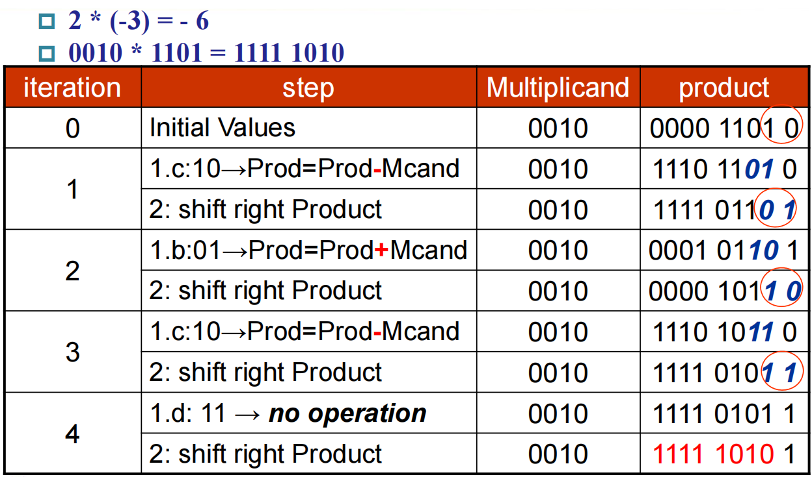

# 计算机算术运算

## 有符号数

有符号数有三种表示方法：

- Sign and Magnitude: 最高位为符号位，其余位为数值位，`3'b111` 代表 -3
- 1's Complement: 大小等于直接取反，`3'b111` 代表 0
- 2's Complement: 大小等于取反加一，`3'b111` 代表 -1

若使用 2 的补码表示法，则无符号数和有符号数的加减法可以统一处理，只是理解不同罢了，例如 `3'b111 + 3'b111 = 3'b110` 既可以理解为得到 -2，也可以理解为得到 6。这是因为在 2 的补码表示法下，有符号数和无符号数同样都是连续的，只是溢出边界的位置不同。

 

## 加减法器

半加法器的公式为：

$$\text{Sum} = \bar{A}B + A\bar{B} = A \oplus B$$

$$\text{Carry} = AB$$

全加法器的公式为：

$$\text{Sum} = A\oplus B\oplus \text{Carry}_{in}$$

$$\text{Carry}_{out} = AB + (A \oplus B)\text{Carry}_{in}$$

这样简单地将全加法器串联起来的，就叫行波进位加法器 (Ripple Carry Adder, RCA)，需要将输入的 Carry 置零。减法器与之类似，只不过需要将减数取反，并将输入的 Carry 置一。

行波进位加法器的缺点是，后面的全加器需要等待前面的全加器运算完成才能获得进位，导致计算延迟非常大，因此改进的关键在于提前获得进位。对此，主要的思路有：

- 超前进位加法器 (Carry Lookahead Adder, CLA): 直接通过输入算出后面的进位，而不是依靠全加器的结果递归计算，不过这样会导致最终公式十分复杂
- 进位旁路加法器 (Carry Skip Adder, CSA): 将全加器分组，在每组内部，全加器可以直接计算出传播条件 $P_i = A_i \oplus B_i$，若该组内传播条件全为 1，则直接选择 $C_{in}$ 作为 $C_{out}$，从而跳过该组内部的进位计算
- 进位选择加法器 (Carry Select Adder, CSA): 将全加器分组，每组先分别假设进位为 0 和 1 计算出两个结果，然后根据 $C_{in}$ 选择正确的结果，这样效果最好，但是成本也非常高

 

## 乘法器

### 无符号乘法

乘法公式：乘积 (product) = 被乘数 (multiplicand) $\times$ 乘数 (multiplier)。

这里以 32 位乘法器为例，乘法器的第一个版本为：

1. 若乘数最低位为 1，则将乘积加上被乘数，否则加上 0
2. 将被乘数左移，乘数右移
3. 若未迭代 32 次，则重新进行

这样需要用到 64 位加法器，且很多时候乘积的低位不会发生变化，产生浪费。由此，可以改进得到乘法器的第二个版本：

1. 若乘数最低位为 1，则将乘积的高 32 位加上被乘数，否则加上 0
2. 将乘积和乘数右移一位
3. 若未迭代 32 次，则重新进行

在这个乘法器里，越早加进乘积的，右移的次数越多，从而实现错位相加的效果。然而，这里乘积的低 32 位仍有浪费，因此可以进一步改进得到乘法器的第三个版本：

1. 将乘数放进乘积的低 32 位
2. 若乘积最低位为 1，则将乘积的高 32 位加上被乘数，否则加上 0
3. 将乘积右移一位
4. 若未迭代 32 次，则重新进行

### 有符号乘法

最基本的方法是先将有符号数转换为无符号数，然后进行无符号乘法，最后再将结果转换为有符号数。另一种方法是 Booth 算法。

Booth 的基本思想是将乘数分解为简单的幂的加减，如将 10111100 分解为 $2^7 + 2^6 - 2^2$，这样就能将加减法变为简单的移位，从而加速运算。具体操作就是：

1. 将乘数放进乘积的低 32 位
2. 根据乘积最低位和前一位（前一位初始为零）判断执行什么运算：
   - 若当前位和前一位为 00，代表在 0 中间，不操作
   - 若当前位和前一位为 01，代表 1 序列结束，加上乘数
   - 若当前位和前一位为 10，代表遇到 1 序列，减去乘数
   - 若当前位和前一位为 11，代表在 1 中间，不操作
3. 将乘积右移一位
4. 若未迭代 32 次，则重新进行

之所以 Booth 算法能够计算有符号数乘法，是因为有符号负数最高位为 1，最后一个 1 序列无法结束，因此无法加上 $2^{32}$，从而使得乘数实际上为表面值减去 $2^{32}$，恰好等于其含义值。

!!! example "Booth 算法示例"

    

 

## 除法器

除法公式：被除数 (dividend) = 商 (quotient) $\times$ 除数 (divisor) + 余数 (remainder)。

这里以 32 位除法器为例，除法器的第一个版本为：

1. 将除数放在所在寄存器的高 32 位，被除数放在余数的低 32 位
2. 从余数减去除数，若结果大于零，则将商左移补一，否则重新将除数加回余数，并将商左移补零
3. 将除数右移一位
4. 若未迭代 33 次，则重新进行

在迭代 32 次后，除数才刚刚移到低 32 位，还没来得及去减被除数，因此还需要再多迭代一次。

在这个除法器中，余数的高 32 位利用率低，除数需要 64 位的寄存器，加减法也需要用到 64 位 ALU，因此效率不高。通过改进，可以得到除法器的第二个版本：

1. 将被除数放在余数的低 32 位，然后左移一位
2. 从余数的高 32 位减去除数，若结果大于零，则将余数左移补一，否则重新将除数加回余数的高 32 位，然后将余数左移补零
3. 若未迭代 32 次，则重新进行

这样以后，余数的低 32 位就是商，高 32 位就是实际的余数。

 

## 浮点数

### 浮点数的表示

现行浮点数均采用 IEEE 754 标准，浮点数从左到右被分为三个部分：符号位、指数位和尾数位。需要注意的是，浮点数的小数点之前默认为 1，不需要存储。因此，最终结果为

$$x = (-1)^S \times (1 + \text{Fraction}) \times 2^{\text{Exponent} - \text{Bias}}$$

- 单精度浮点数：
    - 指数位占 8 位，偏移量为 127
    - 尾数位占 23 位，精度约为 $\log_{10} 2^{23} \approx 23 \times 0.3 \approx 7$
- 双精度浮点数：
    - 指数位占 11 位，偏移量为 1023
    - 尾数位占 52 位，精度约为 $\log_{10} 2^{52} \approx 52 \times 0.3 \approx 16$

!!! example "单精度浮点数表示"

    $85.125 = 1.010101001 \times 2^{6}$

    $6 + 127 = 133 = 10000101_2$

    因此 85.125 的单精度浮点数表示为：
    
    $0\ 10000101\ 01010100100000000000000 = \text{42AA4000}$

---

指数位取最小值和最大值都有特殊意义，因此指数位的实际取值范围为 $[1, 254]$ 或 $[1, 2046]$，从而浮点数的取值范围为：

- 单精度浮点数：$[1.0 \times 2^{-126}, 2.0 \times 2^{127}] \approx [1.2 \times 10^{-38}, 3.4 \times 10^{38}]$
- 双精度浮点数：$[1.0 \times 2^{-1022}, 2.0 \times 2^{1023}] \approx [2.2 \times 10^{-308}, 1.8 \times 10^{308}]$

若数字过大而无法表示，则会发生上溢；若数字过小而无法表示，则会发生下溢。

---

当指数位全为 0 时，表示的是非规格化数，此时尾数位的最高位默认为 0：

$$x = (-1)^S \times (0 + \text{Fraction}) \times 2^{1 - \text{Bias}}$$

这样单精度浮点数的取值范围就变为了 $[2^{-149}, 2^{-126}]$，双精度浮点数的取值范围变为 $[2^{-1074}, 2^{-1022}]$，另外还有 $\pm 0$。

当指数位全为 1 时，表示的是特殊数：

- 若尾数位全为 0，则表示的是 $\pm \inf$
- 若尾数位不全为 0，则表示的是 NaN（Not a Number），意为非法或者未定义的结果，可用于表示 $0/0$ 或者 $\infty - \infty$ 等情况

各种可能的组合如下：

Exponent | Fraction | Object
--- | --- | ---
0 | 0 | 0
0 | 不等于 0 | 非规格化数
1 - 254/2046 | 任意数 | 规格化数
255/2047 | 0 | infinity
255/2047 | 不等于 0 | NaN

### 浮点数的运算

浮点数加减法的步骤为：

1. 对齐，将指数较小的浮点数的尾数右移，直到两个浮点数的指数相等
2. 将有效数字带符号位相加
3. 规格化结果并判断是否发生溢出
5. 舍入，若有必要则再进行规格化

浮点数乘法的步骤为：

1. 将两个指数相加，同时需要减去偏移量，得到新的指数
2. 将两个尾数相乘，得到新的尾数
3. 规格化结果并判断是否发生溢出
4. 舍入，若有必要则再进行规格化
5. 判断新的符号位

浮点数除法与乘法类似，只是变成指数相减，尾数相除。

需要注意的是，由于舍入误差，浮点数的运算结果与运算顺序有关。

### 浮点数的舍入

IEEE 754 定义了四种不同的舍入方式：

- 向零舍入
- 向上舍入
- 向下舍入
- 向偶数舍入，当有两个最接近的值时，选择尾数为偶数的值，为默认情况

为了更好地保证精度，IEEE 754 标准规定了额外的位用于控制舍入：

- 保留位 (guard bit) 是结果的最低位后的额外一位
- 近似位 (round bit) 是紧随保留位之后的一位
- 粘滞位 (sticky bit) 是近似位之后的所有位的或运算结果，表明之后是否还有非零位

若对齐时右移一位，保留位可以保留住被移除的位，从而避免精度损失；若对齐右移大于一位，那么此时未移位的有效数字在 [1, 2) 范围内，被移位的有效数字在 [0, 0.5) 范围内，两数加减得到的数在 [0.5, 2.5) 范围内，因此规则化时最多左移一位。

这时，就可以看出为什么需要三个额外的位了，因为这样在左移一位以后，也能保证还有两个额外的位用于判断是否大于/等于/小于 $1/2$ ULP (Unit in the Last Place)。由此可见，保留位、近似位和粘滞位都是有其作用的。

!!! note "向偶数舍入"

    若要向偶数舍入，则 $1.0000\ 100 = 1.0000$, $1.0001\ 100 = 1.0010$

!!! example "额外位作用示例"

    设只保留三位尾数 (mantissa)，则 $30 = 1.111 \times 2^4$, $3.25 = 1.101 \times 2^1$

    若将两者相加，则得到 $(1.111\ 000 + 0.001\ 101) \times 2^4 = 1.000\ 011 \times 2^5$

    此时 grs 为 011，小于 $1/2$ ULP，因此最终结果为 $1.000 \times 2^5 = 32$
