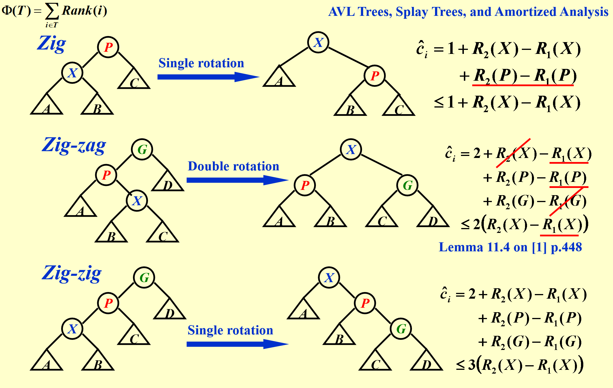
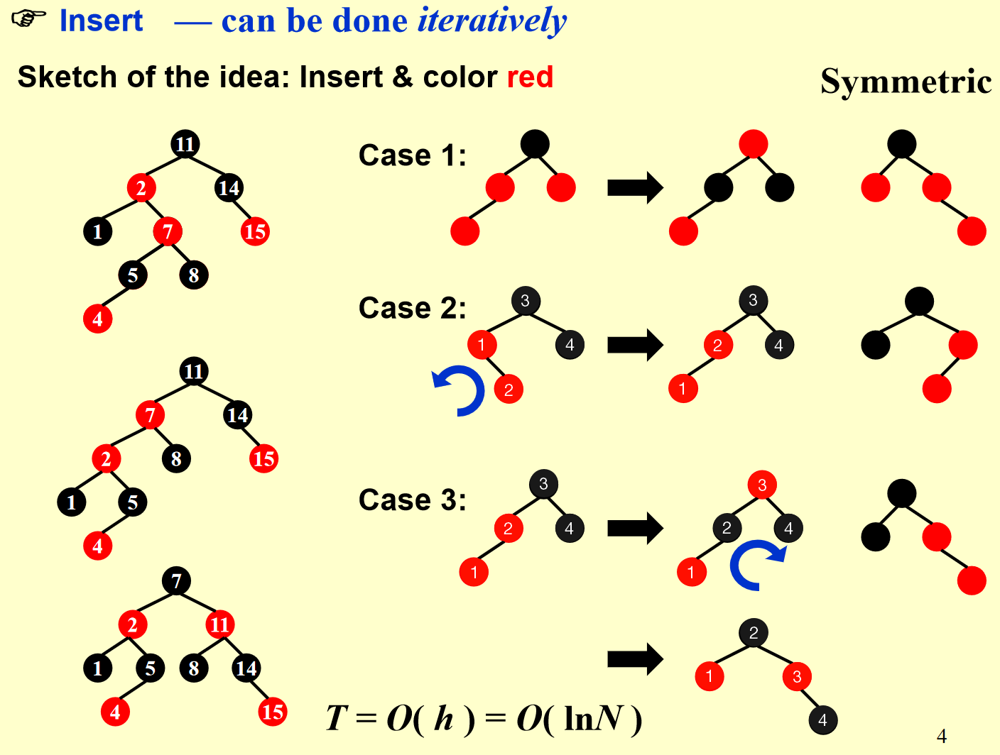
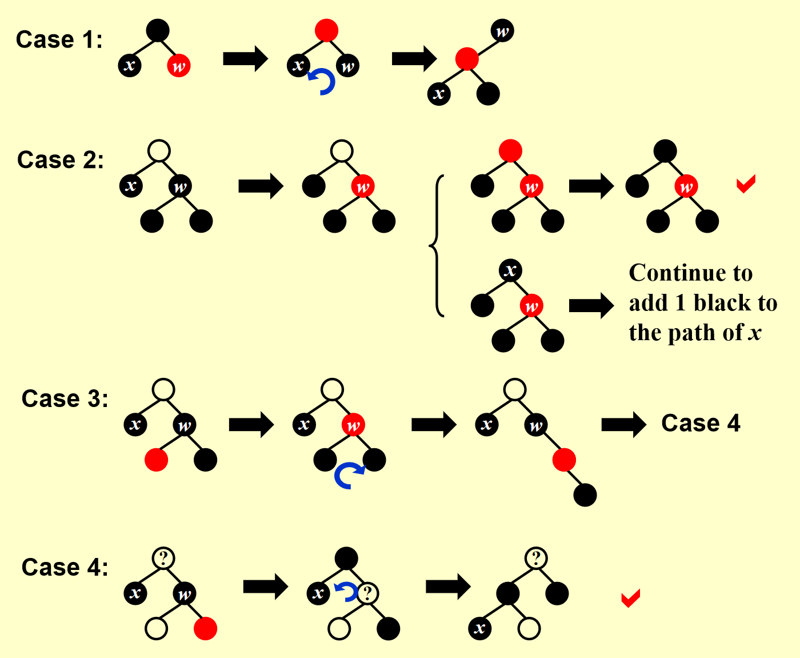
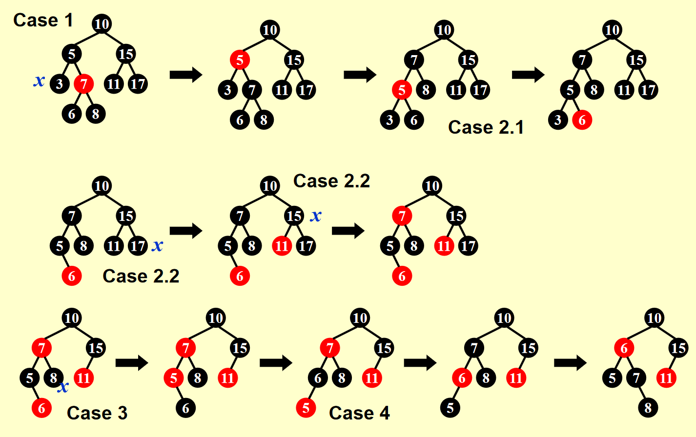
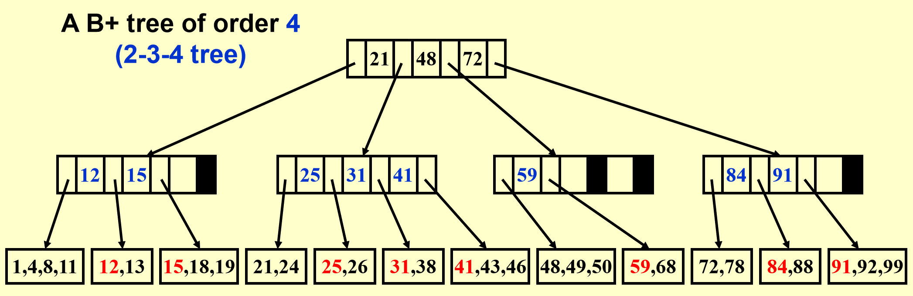

# 高级数据结构与算法分析笔记

## AVL Tree

定义空树的深度为 -1，同时定义平衡因子 $BF = h_L - h_R$，则在平衡树中，每个节点的平衡因子 (Balance Factor) 只能是 -1, 0, 1

Tree Rotation 是一种不会改变元素顺序的对二叉树的操作，是 AVL Tree 的核心操作，分为四种情况：

- Case 1: 当不平衡节点发现插入节点在左子树的左子树时，进行 LL Rotation 调整，具体就是将左子树提升为新的根节点，原根节点成为新根节点的右子树，即进行右旋
- Case 2: 当不平衡节点发现插入节点在右子树的右子树时，进行 RR Rotation 调整，具体就是将右子树提升为新的根节点，原根节点成为新根节点的左子树，即进行左旋
- Case 3: 当不平衡节点发现插入节点在左子树的右子树时，进行 LR Rotation 调整，具体就是将左子树的右子树先左旋再右旋，提升为新的根节点
- Case 4: 当不平衡节点发现插入节点在右子树的左子树时，进行 RL Rotation 调整，具体就是将右子树的左子树先右旋再左旋，提升为新的根节点

---

现欲构造一棵高度为 $h$ 的树，定义 $n_h$ 为所需的最少节点数，$n_h = n_{h-1} + n_{h-2} + 1$，其中 $n_0 = 1, n_1 = 2$，则有：

$$n_h = F_{h+3} - 1$$

其中 $F_0 = 0, F_1 = 1, F_i \approx \frac{1}{\sqrt{5}} \left( \frac{1 + \sqrt{5}}{2} \right)^i$。

所以 $n_h \approx \frac{1}{\sqrt{5}} \left( \frac{1 + \sqrt{5}}{2} \right)^{h+3} - 1$，AVL Tree 的高度为 $O(\log n)$。

 

## Splay Tree

Splay Tree 是一种自调整的二叉搜索树，通过旋转操作将被访问的节点提升到根节点，以提高后续访问的效率。虽然其单步操作复杂度可能超过 $log(N)$，但其在执行了 $M$ 个操作后，均摊时间复杂度为 $O(M\log N)$。

具体来说，对任意节点 $X$，定义其父节点为 $P$，祖父节点为 $G$，则有以下三种情况：

- Zig/Zag: 当 $P$ 是根节点时，对 $X$ 进行单旋转
- Zig-Zig: 当 $P$ 和 $G$ 在同一侧时，先对 $P$ 进行单旋转，再对 $X$ 进行单旋转
- Zig-Zag: 当 $P$ 和 $G$ 在不同侧时，先对 $X$ 进行单旋转，再对 $X$ 进行单旋转

每次 Splay 操作都会将被访问的节点提升到根节点，大致会将高度砍半。

若要删除 $X$ 节点，可以先将 $X$ 旋转到根节点，删除 $X$ 得到 $T_L$ 和 $T_R$，然后找到 $T_L$ 中最大的元素，使其成为根节点，$T_R$ 接在根节点的右侧。

 

## 均摊分析

均摊上界考虑的是最坏的情况，而平均上界则会考虑数据分布的影响。

若要证明一个数据结构的均摊复杂度，可以使用聚合法、势能法、记账法等。

### 聚合法

聚合法 (Aggregate method) 是一种分析数据结构的均摊复杂度的方法，通过执行 $N$ 个最坏时间的操作，然后将其分摊到每个操作上，得到均摊复杂度，比如 MultiPop 的均摊复杂度是 $O(n) / n = O(1)$。

### 核算法

核算法 (Accounting method) 将每个操作的代价分为实际代价 (actual cost, $c_i$) 和均摊代价 (amortized cose, $\hat{c}_i$) ，当一个操作的均摊代价大于实际代价时，我们将其差额记入信用 (credit)，当均摊代价小于实际代价时，可用信用来支付，必须保证信用始终大于零。

对于栈操作，我们以栈中的元素个数为信用，又易得实际代价，由此得出其均摊代价为：

操作 | 实际代价 | 均摊代价
:---: | :---: | :---:
Push | 1 | 2
Pop | 1 | 0
MultiPop | $\min(\text{sizeof}(S), k)$ | 0

故其 $n$ 步操作的均摊代价为 $O(2 \cdot n) = O(n)$。

### 势能法

势能法 (Potential method) 会先定义一个势能函数 $\Phi$，使得 $\hat{c}_i - c_i = Credit = \Phi(D_i) - \Phi(D_{i-1})$，且一个好的势能函数应使 $\Phi(D_0)$ 为最小值，然后就可以得到每个操作的均摊代价 $\hat{c}_i = c_i + \Phi(D_i) - \Phi(D_{i-1})$。

在 MultiPop 操作中，可以定义势能函数为栈中元素数，那么其实际代价为 $k$，势能函数下降 $k$，故其均摊代价为 $k - k = 0$。

在 Splay 树中，可以定义势能函数为 $\Phi(T) = \sum_{i\in T} \log S(i) = \sum_{i\in T} Rank(i)$，其中 $S(i)$ 为以 $i$ 为根节点的子树的节点数，然后由 $\forall a, b \gt 0, a + b \le c: \log a + \log b \lt 2\log c - 2$ 可得每种操作的均摊上界：

  

而后可以得到总的将 $X$ 旋转到根节点的均摊上界为 $1 + 3(R_2(X) - R_1(X))$。由于 Zig 操作最多进行一次，所以最后可得均摊上界为 $O(\log N)$。

 

## 红黑树

一个红黑树需要满足如下性质：

1. 每个节点要么是红色，要么是黑色
2. 根节点为黑色
3. NIL 节点为黑色
4. 不能有两个相邻的红色节点 / 红色的子节点为黑色
5. 对任一节点，从该节点到 NIL 节点的所有路径的黑色节点数相同

定义黑高 $bh(x)$ 为从节点 $x$ 到叶子节点的黑色节点数目，不包括 NIL 和自己。可以用数学归纳法证明，对于大小为 $N$ 的红黑树，有 $bh(Tree) \le 2\ln(N+1)$

### 插入

红黑树的插入操作分为两步：

1. 插入节点，将其颜色设为红色
2. 维护红黑树，使其满足红黑树的性质

插入红色节点仅可能破坏性质四，若插入节点的父节点为黑色则不必维护，若为红色则又分为三种情况：

- Case 1: 父节点为红色，叔节点为红色，此时将父节点和叔节点设为黑色，祖父节点设为红色，然后将祖父节点设为红色，这样可以保证从祖父节点开始的每条路黑高不变，接下来继续向上维护祖父节点
- Case 2: 父节点为红色，叔节点为黑色，且插入节点、父节点、祖父节点不在同一侧，此时将插入节点旋转上去，使得三个节点在同一侧，转换为 Case 3，否则无法保证黑高不变
- Case 3: 父节点为红色，叔节点为黑色，且插入节点、父节点、祖父节点在同一侧，此时同 Case 1 一样，先将父节点和叔节点设为黑色，祖父节点设为红色，再将父节点旋转上去，这样可以保证从新的祖父节点开始黑高不变

  

单次插入最多需要进行两次旋转，即 Case 2 -> Case 3。

### 删除

红黑树的删除与插入一样，先像普通二叉搜索树一样删除，然后有必要时再维护，根据待删除节点的非 NIL 子节点数分为三种情况：

- 待删除节点为叶子节点，若为红色则直接删除，若为黑色则需要维护
- 待删除节点有一个非 NIL 子节点，此时子节点必为红色，从而待删除节点必为黑色，故直接将子节点替换待删除节点，然后将子节点设为黑色即可
- 待删除节点有两个非 NIL 子节点，此时找到前驱或后继替换待删除节点，然后再删除前驱或后继，转换为前两种情况

所以最后需要维护的只有删除黑色叶子节点的情况。删除的基本思路是，要么使待删除节点处多点黑，要么使兄弟节点处多点红。具体而言，分为四种情况：

- Case 1: 兄弟节点为红色，此时需要将兄弟节点设为黑色，父节点设为红色，然后将兄弟节点旋转上去。这样以后，新的兄弟节点必为黑色，且因为待删除节点不是 NIL 节点，新的兄弟节点一定不是 NIL，待删除节点一定有侄子节点，由此转换为 Case 2, 3, 4
- Case 2: 侄子节点全为黑色，此时将兄弟节点设为红色，以向上传递黑色。若父节点为红色，则将其设为黑色，实现了待删除节点所在路径黑高加一而兄弟节点所在路径黑高不变；若父节点为黑色，则黑色传递不上去，损失了一个黑高，需要像维护待删除节点一样向上维护父节点
- Case 3: 近侄子为红色，远侄子为黑色，此时需要进行如图操作，使得远侄子变为红色，转换为 Case 4
- Case 4: 远侄子为红色，此时进行如图操作，即可实现待删除节点所在路径黑高加一而兄弟节点所在路径黑高不变

  

一个删除的示例为：

  

单次删除最多需要进行三次旋转，即 Case 1 -> Case 3 -> Case 4。

 

## B+ 树

B+ 树是一种多叉排序树，每个节点会存储多个键值，其中非叶子节点最多有 $M - 1$ 个键值，代表对应子树的最小值，将子树分为最多 $M$ 个区间。一个 $M$ 阶 B+ 树有如下性质：

1. 根节点要么是叶子节点，要么有 $2$ 到 $M$ 个子节点
2. 除根节点外，所有非叶子节点有 $\lceil M / 2 \rceil$ 到 $M$ 个子节点
3. 所有的叶子节点都在同一层，有 $\lceil M / 2 \rceil$ 到 $M$ 个键值

一般来说，$M$ 只取 3 或 4，以下是一个四阶 B+ 树的例子：

  

### 插入

插入操作的步骤大致为：

1. 找到合适的叶子节点插入
2. 若当前节点的键值数目未超过 $M$，则直接返回
3. 若当前节点的键值数目超过 $M$，则进行分裂操作。若有父节点，则使父节点多出一个键值，继续迭代向上维护；若无父节点，则新建一个有两个子节点的父节点

一种优化的做法是，在节点键值数目超过 $M$ 时，不立即分裂，而是看看能不能将多余的键值推到兄弟节点。

### 删除

删除操作的步骤大致为：

1. 找到对应的叶子节点删除键值
2. 若当前节点的键值数目满足平衡条件，则直接返回
3. 若当前节点的键值数目小于 $\lceil M / 2 \rceil$，则先看看能否从兄弟节点借一个键值，若不能再进行合并操作。若有父节点，则使父节点少一个键值，继续迭代向上维护；若无父节点且仅剩一个子节点，则将子节点设为新的根节点

